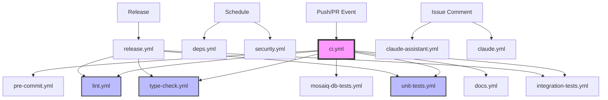

# PyMedPhys CI/CD Workflows

## Overview

PyMedPhys uses GitHub Actions for continuous integration and deployment. The workflow architecture follows a modular design with separated concerns for better visibility and maintainability.

## Workflow Architecture



## Workflow Structure

### Core Workflows (Run on All PRs)

#### `ci.yml` - Main Orchestrator
Coordinates all CI checks based on file changes, labels, and event types.

- **Triggers**: Push to main, pull requests, workflow_call
- **Jobs**:
  - `changes`: Detects file changes using path filters
  - `pre-commit`: Auto-formatting and basic checks
  - `lint`: Code quality (always runs)
  - `type-check`: Static type checking (always runs)
  - `unit-tests`: Fast unit tests (always runs)
  - `integration-tests`: Extended tests (conditional)
  - `mosaiq-db-tests`: Database tests (conditional)
  - `docs-check/publish`: Documentation (conditional)
  - `cypress-e2e`: E2E tests (main only)
  - `summary`: Generates comprehensive report

#### `pre-commit.yml`
Runs pre-commit hooks for code formatting and basic checks.

- **Features**:
  - Auto-fixes issues on PRs
  - Commits fixes automatically with bot account
  - Caches pre-commit environments

#### `lint.yml` ⭐ NEW
Dedicated linting workflow for code quality.

- **Jobs**:
  - `ruff`: Fast Python linter and formatter
  - `pylint`: Comprehensive Python linting
- **Always runs on PRs** for early issue detection

#### `type-check.yml` ⭐ NEW
Static type checking for type safety.

- **Jobs**:
  - `pyright`: Primary type checker
  - `mypy`: Secondary checker (optional/non-blocking)
- **Always runs on PRs** to ensure type safety

#### `unit-tests.yml` ⭐ NEW
Fast unit tests with smart matrix strategy.

- **Features**:
  - Full OS matrix on main (Ubuntu, Windows, macOS)
  - Quick mode for PRs (Ubuntu +  latest supported Python version)
  - Excludes slow tests for rapid feedback
  - JUnit XML report generation

### Extended Workflows (Conditional)

#### `integration-tests.yml` ⭐ NEW
Comprehensive testing beyond unit tests.

- **Test Types**:
  - `doctests`: Documentation code examples
  - `slow-tests`: Long-running integration tests
  - `stackoverflow`: Example code validation
  - `wheel-build`: Package build verification
  - `propagate`: Propagation script tests
- **Triggers**: Main branch or `full-test` label

#### `mosaiq-db-tests.yml`
SQL Server integration tests for Mosaiq database functionality.

- **Service**: SQL Server 2022 container
- **Triggers**: Database code changes or `database` label
- **Features**: Automatic retries for connection stability

#### `docs.yml`
Builds and deploys documentation to GitHub Pages.

- **Modes**:
  - `docs-check`: Build verification on PRs with doc changes
  - `docs-publish`: Deploy to GitHub Pages on main
- **Deployment**: docs.pymedphys.com

### Release & Maintenance

#### `release.yml`
Handles PyPI package publishing with quality gates.

- **Quality Checks**: Runs lint, type-check, unit, and integration tests
- **Features**:
  - TestPyPI dry-run capability
  - PyPI trusted publishing (no API tokens)
  - Automatic release asset upload
  - Installation verification

#### `security.yml`
Enhanced security scanning and vulnerability detection.

- **Scans**:
  - `secrets-scan`: API key exposure detection
  - `dependency-audit`: pip-audit for vulnerabilities
  - `python-security`: Bandit security linting
  - `container-scan`: Trivy filesystem scanning
  - `github-actions-security`: Workflow security patterns
- **Schedule**: Weekly + on main pushes + PR changes

#### `deps.yml`
Automated dependency updates.

- **Schedule**: Weekly (Mondays)
- **Features**:
  - Creates PR with uv lock updates
  - Includes changelog in PR description
  - Runs tests before creating PR

### AI Assistance

#### `claude.yml`
Claude Code integration for automated code assistance.

- **Triggers**: Comments with `@claude` mention
- **Capabilities**: Code review, issue analysis, PR creation
- **Tools**: File operations, git, uv package management

#### `claude-assistant.yml`
Claude chatbot for issue discussions.

- **Triggers**: Comments with `!claude` mention
- **Features**:
  - Rate limiting protection
  - Security filtering
  - Context-aware responses

## Composite Actions

### `actions/setup-project/action.yml`
Standardized project setup for all workflows.

- **Features**:
  - Python setup with configurable version
  - uv package manager with caching
  - Optional Node.js setup
  - PyMedPhys data caching
  - Dependency installation with extras

## PR Workflow

For a typical pull request:

```
Always Run:
├── pre-commit        # Auto-formatting
├── lint             # Ruff + Pylint
├── type-check       # Pyright
└── unit-tests       # Quick mode (Ubuntu + latest supported Python version)

Conditional:
├── mosaiq-db-tests  # If database files changed
├── docs-check       # If documentation changed
└── security         # If Python/config files changed
```

## Main Branch Workflow

On merge to main:

```
Everything from PR workflow, plus:
├── unit-tests         # Full matrix (all OS + Python versions)
├── integration-tests  # All extended tests
├── cypress-e2e       # Browser tests (if present)
├── docs-publish      # Deploy to GitHub Pages
└── security          # Full security scan
```

## Required Secrets

| Secret | Description | Used By |
|--------|-------------|---------|
| `ANTHROPIC_API_KEY` | Claude AI API access | claude.yml, claude-assistant.yml |
| `GITHUB_TOKEN` | GitHub API access (automatic) | All workflows |
| `PYMEDPHYS_CI_BOT_ID` | Bot app ID for auto-commits | pre-commit.yml (optional) |
| `PYMEDPHYS_CI_BOT_TOKEN` | Bot private key | pre-commit.yml (optional) |

## Environments

| Environment | Description | Protection Rules |
|-------------|-------------|------------------|
| `pypi` | PyPI publishing | Required reviewers, main branch only |
| `claude-api` | Claude API access | Rate limiting recommended |

## Branch Protection Settings

Required status checks for merge:
- ✅ `pre-commit`
- ✅ `lint`
- ✅ `type-check`
- ✅ `unit-tests`

## Labels for Manual Triggers

- `full-test` - Run integration tests on a PR
- `database` - Force database tests to run
- `skip-ci` - Skip CI checks (use sparingly)

## Performance Optimization

### Caching Strategy

- **uv cache**: Dependencies cached by lock file hash
- **Pre-commit cache**: Cached by config file hash
- **PyMedPhys data**: Cached by data hash file
- **Node modules**: Cached by package-lock.json

### Parallel Execution

- Matrix builds run in parallel (OS × Python version)
- Independent workflows run separately
- Concurrency groups prevent duplicate runs on PR updates

### Resource Usage

- **Quick PR feedback**: ~5-10 minutes for core checks
- **Full main branch CI**: ~20-30 minutes with all tests
- **Release workflow**: ~30-40 minutes with full validation

## Common Maintenance Tasks

### Adding a New Python Version

1. Update matrix in `unit-tests.yml`:
   ```yaml
   python-matrix:
     default: '["3.10", "3.11", "3.12", "3.13"]'
   ```

2. Update `action.yml` default if needed:
   ```yaml
   python-version:
     default: '3.13'
   ```

### Modifying Test Behavior

- **Skip specific tests**: Add pytest markers
- **Change timeouts**: Modify `timeout-minutes` in workflows
- **Add test categories**: Create new jobs in `integration-tests.yml`

### Debugging Failed Workflows

1. **Check job summaries**: View the CI summary table
2. **Download artifacts**: Get JUnit XML test reports
3. **Re-run specific jobs**: Use GitHub UI "Re-run failed jobs"
4. **Enable debug logging**:
   ```yaml
   env:
     ACTIONS_RUNNER_DEBUG: true
     ACTIONS_STEP_DEBUG: true
   ```

### Testing Workflows Locally

```bash
# Install act
brew install act  # or appropriate for your OS

# Test CI workflow
act push -W .github/workflows/ci.yml

# Test with specific inputs
act push -W .github/workflows/unit-tests.yml \
  --input python-matrix='["3.12"]' \
  --input quick=true

# Test PR workflow
act pull_request -W .github/workflows/ci.yml
```

### Local Development Commands

```bash
# Install with dev dependencies
uv sync --frozen --extra dev --extra tests

# Run all pre-commit hooks
uv run pre-commit run --all-files

# Run specific checks matching CI
uv run ruff check
uv run ruff format --check
uv run pyright
uv run pytest -m "not slow"
uv run pymedphys dev lint

# Run slow tests locally
uv run pytest -m slow

# Build docs locally
uv run pymedphys dev docs
```

## Troubleshooting

### Common Issues

#### Pre-commit Auto-fix Not Working
- Check bot has write permissions on repository
- Ensure PR is from same repo (not a fork)
- Verify `GITHUB_TOKEN` has appropriate permissions

#### Tests Failing Only in CI
- Check for OS-specific issues (path separators, line endings)
- Verify all test data files are committed
- Check environment variable differences
- Review timezone/locale dependencies

#### Mosaiq Database Tests Failing
- SQL Server needs 30+ seconds to start
- Check password meets SQL Server requirements
- Verify connection string format
- Review firewall/port settings

#### Documentation Not Deploying
- Verify GitHub Pages enabled in settings
- Check `pages` permission in workflow
- Ensure no build errors in docs job
- Verify CNAME file if using custom domain

#### Type Checking Discrepancies
- Ensure same pyright version locally and in CI
- Check for missing type stubs
- Verify all dependencies installed
- Review pyproject.toml type checking config

#### Claude Not Responding
- Verify `ANTHROPIC_API_KEY` secret is set
- Check trigger pattern (`@claude` or `!claude`)
- Review rate limiting logs
- Verify comment isn't from a bot

### Performance Issues

#### Slow CI Runs
- Check matrix strategy (reduce for PRs)
- Review test parallelization
- Optimize Docker layer caching
- Consider self-hosted runners for heavy workloads

#### Cache Misses
- Verify cache key includes all dependencies
- Check cache size limits (10GB max)
- Review cache eviction (7 days unused)
- Consider multiple cache keys with fallbacks

## Security Considerations

- **Never commit secrets**: Use GitHub Secrets
- **Review permissions**: Minimum required for each workflow
- **Enable Dependabot**: Keep actions updated
- **Audit third-party actions**: Pin to commit SHAs
- **Rotate keys periodically**: Especially API keys
- **Review security alerts**: Weekly scan results
- **Limit workflow triggers**: Avoid `pull_request_target` misuse

## Migration Guide

### From Monolithic to Modular Workflows

1. **Phase 1**: Add new workflow files
   - Keep existing `tests.yml` as compatibility wrapper
   - Add new modular workflows alongside

2. **Phase 2**: Update CI orchestration
   - Replace `ci.yml` with new version
   - Update branch protection rules

3. **Phase 3**: Clean up
   - Remove compatibility wrappers
   - Update documentation
   - Train team on new structure

## Contributing

When modifying workflows:

1. **Test in feature branch** using `workflow_dispatch`
2. **Update this README** for any changes
3. **Follow patterns** for consistency
4. **Add error handling** and retries where appropriate
5. **Document inputs/outputs** for reusable workflows
6. **Consider backward compatibility** for breaking changes

## Version Compatibility

- **Python**: 3.10 - 3.12 (tested in CI)
- **Node.js**: 20.x (for Cypress and build tools)
- **uv**: Latest version (auto-updated)
- **GitHub Actions**: Ubuntu 22.04, Windows 2022, macOS 12/13/14
- **SQL Server**: 2022 Latest (for Mosaiq tests)

## Getting Help

1. Check workflow run logs in Actions tab
2. Review this README for configuration
3. Search existing issues with `ci/cd` label
4. Open new issue with reproduction steps
5. Check [GitHub Actions documentation](https://docs.github.com/actions)

## License

These workflows are part of the PyMedPhys project and follow the same Apache 2.0 license.
