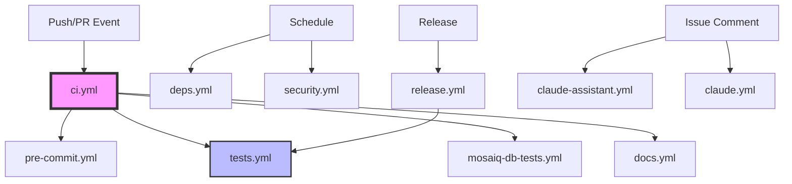

# PyMedPhys CI/CD Workflows

## Overview

PyMedPhys uses GitHub Actions for continuous integration and deployment. The workflow architecture follows a modular design with reusable workflows for better maintainability and consistency.

## Workflow Architecture



## Core Workflows

### 🎯 Main Orchestrator

#### `ci.yml`
The primary workflow that orchestrates all CI checks on push and pull requests.

- **Triggers**: Push to main, pull requests, manual dispatch
- **Jobs**:
  - `changes`: Detects file changes for conditional testing
  - `pre-commit`: Code quality checks
  - `tests`: Full test suite (delegates to tests.yml)
  - `mosaiq-db-tests`: Database integration tests (conditional)
  - `docs`: Documentation build and deployment
  - `summary`: Generates job summary report

### 🧪 Testing Workflows

#### `tests.yml` (Reusable)
Comprehensive test suite with OS and Python version matrix.

- **Inputs**:
  - `mode`: "standard" (fast) or "full" (comprehensive)
  - `python-matrix`: List of Python versions to test
  - `include-cypress`: Whether to run E2E tests
  - `extra-pytest-args`: Additional pytest arguments

- **Test Types**:
  - `unit`: Core functionality tests (all OS/Python combinations)
  - `doctests`: Documentation code examples
  - `lint`: Pylint code quality checks
  - `pyright`: Type checking
  - `slow`: Long-running integration tests
  - `wheel-test`: Package build verification
  - `ui-e2e`: Cypress browser tests
  - `propagate`: Propagation script tests
  - `stackoverflow`: Example code validation

#### `mosaiq-db-tests.yml`
SQL Server integration tests for Mosaiq database functionality.

- **Service**: SQL Server 2022 container
- **Features**: Automatic retries for database connection

### 📝 Code Quality

#### `pre-commit.yml`
Runs pre-commit hooks for code formatting and linting.

- **Features**:
  - Auto-fixes issues on PRs
  - Commits fixes automatically with bot account
  - Caches pre-commit environments

### 📚 Documentation

#### `docs.yml`
Builds and deploys documentation to GitHub Pages.

- **Triggers**:
  - Push to main (auto-deploy)
  - PRs (build check only)
  - Manual dispatch with publish option
- **Deployment**: GitHub Pages (docs.pymedphys.com)

### 🚀 Release Management

#### `release.yml`
Handles PyPI package publishing.

- **Triggers**: GitHub release creation, manual dispatch
- **Features**:
  - Builds wheel and source distributions
  - TestPyPI dry-run capability
  - PyPI trusted publishing (no API tokens needed)
  - Automatic release asset upload

### 🔒 Security & Maintenance

#### `security.yml`
Weekly security scanning and vulnerability detection.

- **Tools**:
  - Bandit (Python security linting)
  - Trivy (dependency vulnerabilities)
  - pip-audit (Python package vulnerabilities)
  - Custom API key exposure detection

#### `deps.yml`
Automated dependency updates.

- **Schedule**: Weekly (Mondays)
- **Features**:
  - Creates PR with dependency updates
  - Includes changelog in PR description
  - Runs basic tests before creating PR

### 🤖 AI Assistance

#### `claude.yml`
Claude Code integration for automated code assistance.

- **Triggers**: Comments with `@claude` mention
- **Capabilities**: Code review, issue analysis, pull request creation

#### `claude-assistant.yml`
Claude chatbot for issue discussions.

- **Triggers**: Comments with `!claude` mention
- **Features**:
  - Rate limiting
  - Security filtering
  - Context-aware responses

## Composite Actions

### `actions/setup-project/action.yml`
Standardized project setup for all workflows.

- **Features**:
  - Python setup with configurable version
  - uv package manager with caching
  - Optional Node.js setup for frontend tools
  - Dependency installation with extras support

## Required Secrets

| Secret | Description | Used By |
|--------|-------------|---------|
| `ANTHROPIC_API_KEY` | Claude AI API access | claude.yml, claude-assistant.yml |
| `GITHUB_TOKEN` | GitHub API access (automatic) | All workflows |
| `PYMEDPHYS_CI_BOT_ID` | Bot app ID for auto-commits | pre-commit.yml (optional) |
| `PYMEDPHYS_CI_BOT_TOKEN` | Bot private key | pre-commit.yml (optional) |

## Environments

| Environment | Description | Protection Rules |
|-------------|-------------|------------------|
| `pypi` | PyPI publishing | Required reviewers, only main branch |
| `claude-api` | Claude API access | Rate limiting recommended |

## Common Maintenance Tasks

### Adding a New Python Version

1. Update default in `tests.yml`:
   ```yaml
   python-matrix:
     default: '["3.10","3.11","3.12","3.13","3.14"]'
   ```

2. Update `action.yml` default version if needed:
   ```yaml
   python-version:
     default: '3.14'
   ```

### Modifying Test Behavior

- **Skip slow tests on PRs**: Already configured (standard mode for PRs)
- **Add new test marker**: Update pytest args in `tests.yml`
- **Change test timeout**: Modify `timeout-minutes` in relevant job

### Debugging Failed Workflows

1. **Check job summaries**: View the CI summary table in PR/commit
2. **Re-run specific jobs**: Use GitHub UI "Re-run failed jobs"
3. **Enable debug logging**:
   ```yaml
   env:
     ACTIONS_RUNNER_DEBUG: true
     ACTIONS_STEP_DEBUG: true
   ```

### Updating Dependencies Manually

```bash
# Trigger dependency update workflow
gh workflow run deps.yml
```

### Testing Workflows Locally

Use [act](https://github.com/nektos/act) to run workflows locally:

```bash
# Test CI workflow
act push -W .github/workflows/ci.yml

# Test with specific Python version
act push -W .github/workflows/tests.yml --input python-matrix='["3.13"]'
```

## Performance Optimization

### Caching Strategy

- **uv cache**: Dependencies cached by lock file hash
- **Pre-commit cache**: Cached by config file hash
- **PyMedPhys data**: Cached by data hash file
- **Node modules**: Cached by package-lock.json

### Parallel Execution

- Matrix builds run in parallel (OS × Python version)
- Independent workflows (security, deps) run separately
- Use `concurrency` groups to prevent duplicate runs

### Conditional Execution

- Database tests only run when Mosaiq code changes
- Cypress tests only run on main branch pushes
- Full test suite on main, reduced set on PRs

## Troubleshooting

### Common Issues

#### Pre-commit Auto-fix Not Working
- Check bot permissions on repository
- Ensure PR is from a branch in the same repo (not a fork)

#### Mosaiq Database Tests Failing
- SQL Server container may need more startup time
- Check connection string environment variables
- Verify SQL Server accepts the configured password

#### Documentation Not Deploying
- Verify GitHub Pages is enabled in repository settings
- Check `publish` input is true for push events
- Ensure `pages` permission is granted

#### Claude Not Responding
- Verify `ANTHROPIC_API_KEY` secret is set
- Check comment contains correct trigger (`@claude` or `!claude`)
- Review rate limiting in claude-assistant workflow

### Getting Help

1. Check workflow run logs in Actions tab
2. Review this README for configuration details
3. Open an issue with `ci/cd` label
4. Check [GitHub Actions documentation](https://docs.github.com/actions)

## Contributing

When modifying workflows:

1. Test changes in a feature branch first
2. Use `workflow_dispatch` for manual testing
3. Update this README if adding new workflows
4. Follow the established patterns for consistency
5. Add appropriate error handling and retries

## Version Compatibility

- **Python**: 3.10 - 3.13 (tested in CI)
- **Node.js**: 20.x (for Cypress and build tools)
- **GitHub Actions**: Ubuntu 22.04, Windows 2022, macOS 12/13
- **SQL Server**: 2022 (for Mosaiq tests)

## Security Considerations

- Never commit API keys or secrets
- Use GitHub Secrets for sensitive values
- Enable Dependabot for action updates
- Review security scan results weekly
- Rotate API keys periodically

## License

These workflows are part of the PyMedPhys project and follow the same Apache 2.0 license.
