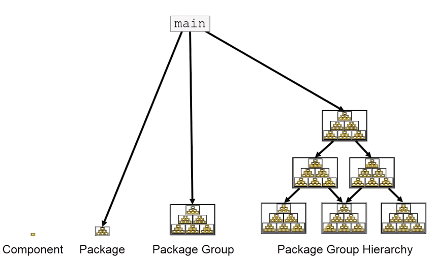

Directory & File Structure
==================================

The PyMedPhys Repository
------------------------

The PyMedPhys repository has the following general structure:

.. code-block:: bash

   pymedphys/
   |   README.rst
   |   LICENSE-AGPL-3.0-or-later
   |   LICENSE-Apache-2.0
   |   changelog.md
   |   setup.py
   |   layers.yml
   |   ...
   |
   |-- docs/
   |
   |-- notebooks/
   |
   |-- packages/
   |
   |-- src/pymedphys/
   |
   |-- ...

Just like most Python libraries, PyMedPhys contains a series of standard,
top-level files. These include:

:``README.rst``: A text file containing general information on the PyMedPhys
                 repository with links to important sections. On `the PyMedPhys
                 GitHub page`_, ``README.rst`` determines the text you see
                 below the file structure.

:``LICENSE-AGPL-3.0-or-later``: A text file that contains a full copy of the
                                AGPL-3.0 license. Since PyMedPhys is licensed
                                under the AGPL-3.0 (with additional terms from
                                the Apache-2.0), it is included for reference.

:``LICENSE-Apache-2.0``: A text file that contains a full copy of the
                         Apache-2.0 license. Since the PyMedPhys license
                         includes terms from the Apache-2.0, it is included for
                         reference.

:``changelog.md``: A text file containing release notes for the PyMedPhys
                   source code library. ``changelog.md`` determines the text
                   presented on the `Release Notes`_ documentation page.

:``setup.py``: A Python script that facilitates easy installation of the
               PyMedPhys library as a package for users and contributors alike.

:``layers.yml``: A configuration file for PyMedPhys' file dependency heirarchy.
                 ``layers.yml`` assigns subpackages and modules to 'levels'
                 that determine which subpackages and modules can import from
                 which other subpackages and modules. More on this in
                 :ref:`source-code`.

You'll quickly note from a cursory look through PyMedPhys that there are
actually many more top-level files. Most of these help configure specific
tasks, such as installation & automated testing. They are probably less
critical to understand in detail in order to comprehend PyMedPhys' structure,
so we'll disregard them for now in the interest of brevity.

(Most of) the rest of PyMedPhys is arranged in the following directories:

:``docs/``: Contains most of PyMedPhys' documentation. The files within
            ``docs/`` make up the text you are reading right now! A
            documentation generator called Sphinx converts the files in
            ``docs/`` into human-readable format. The same tool also pulls the
            docstrings from PyMedPhys' source code and displays them in the
            documentation pages.

:``notebooks/``: Contains a series of experimental `Jupyter notebooks`_.
                 Jupyter notebooks provide a highly convenient way to
                 experiment with code. Some of the `examples`_ are in the form
                 of Jupyter notebooks. Some PyMedPhys contributors prefer to
                 code in Jupyter notebooks to zero in on a solution before
                 attempting to add code to the PyMedPhys library.
                 ``notebooks/`` is a convenient place to store these
                 experimental notebooks, permitting both remote and
                 collaborative raw development.

:``packages/``: The PyMedPhys source code library is separated into a set of
                **subpackages**, from which the main PyMedPhys package draws.
                Users are able to install these subpackages standalone,
                but almost all will instead install the main PyMedPhys
                package. The instructions given in `Installation`_ apply to the
                main PyMedPhys package. Subpackages are not really intended for
                user installation, but rather to provide an optional way to
                deploy applications with minimal dependencies when needed.

                Along with the code in ``src/pymedphys/``, the code within
                ``packages/`` constitutes PyMedPhys proper. In theory (though
                not yet in practice), this code has been thoroughly tested
                and documented. Changes to code in ``packages/`` are tracked in
                ``changelog.md``. Each PyMedPhys subpackage - such as
                ``pymedphys_analysis`` - corresponds to a subdirectory in
                ``packages/``. For more details on the source code structure,
                especially within the subpackages, see the :ref:`source-code`
                section below.

:``src/pympedhys/``: The main PyMedPhys package. Code within this directory
                     is separated into modules (just like the subpackages - see
                     :ref:`source-code`). However, these modules simply import
                     code from ``packages/``; no *library* code is written
                     here. Hence, these module files simply determine which
                     classes, functions etc. in ``packages/`` are exposed to
                     the user.

                     E.g., if the user has installed ``pymedphys`` and wishes
                     to import the ``anonymise_dataset`` function, they would
                     include

                     ``from pymedphys.dicom import anonymise_dataset``

                     in their python file's list of imports. To the user, it
                     would simply appear that ``anonymise_dataset`` is a
                     function inside of a module called ``dicom`` that is
                     contained in ``pymedphys/src/pymedphys``. However, under
                     the hood, ``anonymise_dataset`` is actually a function in
                     a file called ``anonymise.py`` in level 2 of the
                     ``pymedphys_dicom`` subpackage, or:

                     ``pymedphys/packages/pymedphys_dicom/src/pymedphys_dicom/dicom/_level2/anonymise.py``

                     Thankfully, this long path is invisible to the user due to
                     the imports included in the modules of ``pymedphys`` main.
                     For more details on code structure and PyMedPhys'
                     dependency handling, see :ref:`source-code`.

.. _`the PyMedPhys GitHub page`: https://github.com/pymedphys/pymedphys
.. _`examples`: ../user/examples/index.html
.. _`Installation`: ../getting-started/installation.html
.. _`Release Notes`: ../getting-started/changelog.html
.. _`Jupyter notebooks`: https://realpython.com/jupyter-notebook-introduction/
.. _`continuous integration`: https://en.wikipedia.org/wiki/Continuous_integration

.. _source-code:

The PyMedPhys Source Code
-------------------------

Almost all users will access the PyMedPhys library of source code via the
main `pymedphys` package (``pymedphys/src/pymedphys/``). However no library
code actually exists within ``pymedphys/src/pymedphys/``. Instead, library code
is contained within ``pymedphys/packages/`` and redirected through
``pymedphys/src/pymedphys/`` via a set of python imports.

Within ``pymedphys/packages/``, code is organised into a set of subpackages,
such as ``pymedphys_analysis`` and ``pymedphys_dicom``. From there, each
subpackage contains a directory named ``src/<package_name>/``. Within each
``src/<package_name>/``, code is further arranged into categories, such as
``gamma`` and ``mudensity``. These correspond to Python modules. Finally, code
within these category directories is organised into levels. Levels define the
dependency hierarchy of code within modules. See diagram below:

.. code-block:: bash

   pymedphys/
   |
   |-- packages/
   |   |
   |   |-- pymedphys_analysis/
   |   |   |   package.json
   |   |   |   setup.py
   |   |   |
   |   |   |-- src/pymedphys_analysis/
   |   |   |   |   __init__.py
   |   |   |   |   _install_requires.py
   |   |   |   |   _version.py
   |   |   |   |
   |   |   |   |-- gamma/
   |   |   |   |   |   __init__.py
   |   |   |   |   |
   |   |   |   |   |-- _level1/
   |   |   |   |   |   |   __init__.py
   |   |   |   |   |   |   g1a.py
   |   |   |   |   |   |   g1b.py
   |   |   |   |   |
   |   |   |   |   |-- _level2/
   |   |   |   |   |   |   __init__.py
   |   |   |   |   |   |   g2a.py
   |   |   |   |   |   |   g2b.py
   |   |   |   |   |
   |   |   |   |   |-- _level3/
   |   |   |   |       |   __init__.py
   |   |   |   |       |   g3a.py
   |   |   |   |
   |   |   |   |-- mudensity/
   |   |   |   |   |   __init__.py
   |   |   |   |   |
   |   |   |   |   |-- _level1/
   |   |   |   |   |   |   __init__.py
   |   |   |   |   |   |   m1a.py
   |   |   |   |   |
   |   |   |   |   |-- _level2/
   |   |   |   |       |   __init__.py
   |   |   |   |       |   m2a.py
   |   |   |   |       |   m2b.py
   |   |   |   |       |   m2c.py
   |   |   |   |
   |   |   |   |-- ...
   |   |   |
   |   |   |-- tests/
   |   |       |
   |   |       |-- gamma/
   |   |       |   |   test_agnew_mcgarry.py
   |   |       |   |   test_gamma shell.py
   |   |       |
   |   |       |-- mudensity/
   |   |       |   |   test_mu_density_single_regression.py
   |   |       |   |   test_mu_density_leaf_gap.py
   |   |       |   |   ...
   |   |       |
   |   |       |--...
   |   |
   |   |-- ...
   |
   |-- ...

Notice that each subpackage (``pymedphys_analysis`` in the diagram example)
also contains a ``tests/`` directory. As the name suggests, ``tests/`` contains
the suite of automated tests for that particular subpackage. Any code present
in ``src/<subpackage>/`` should be covered by tests in this directory.
Automated testing is essential for effective `continuous integration`_, which
is a core development philosophy of PyMedPhys. If you would like to make
meaningful contributions to PyMedPhys - and become a much better developer as a
result - it pays to get very familiar with automated testing and the code
within these directories.

For the most part, the many ``__init__.py`` files just tell Python to treat
directories containing the files as *packages*. They form part of how
PyMedPhys' code is brought together as installable packages.

Python files within the source code should have descriptive names indicating
the functions of the code within them. For example, ``gammafilter.py`` in level
1 of the ``gamma`` module in ``pymedphys_analysis`` is so-named because it
contains code that calculates gamma pass-rates using a simple pass-fail
filtration algorithm. However, in order to illustrate how levelling works in
PyMedPhys, the files in the above diagram have been named according to their
level and module like so:

``<first-letter-of-module><level number><letter-to-differentiate-files-in-the-same-module-and-level>``

E.g. ``g2a.py`` is the first file in level 2 of the ``gamma`` module in the
above diagram.

The key to levelling is this: **The code contained in files of a particular
level should only depend on code in files of lower-numbered levels. Code should
never depend on code within files of the same level, nor of higher-numbered
levels.**

Note that, in practice, "depend on" really means "import code from" using
Python's ``import`` statement.

In our example, ``g2a.py`` is in level 2, so code in ``g2a.py`` can import code
from ``g1a.py``, because ``g1a.py`` is in level 1 (a lower-numbered level). In
contrast, code in ``g2a.py`` *cannot* import code from ``g2b.py`` (which is in
the same level) or ``g3a.py`` (which is in a higher-numbered level).

*This philosophy applies for modules (categories within subpackages) as well:*
Each module has an assigned level. A module's level is flexible; it can be
adjusted as needed. Modules are assigned levels in the file ``layers.yml``.
View this file to see the currently assigned level of a given module. Just as
with files, modules of a given level can import from lower level modules, but
not from modules of the same or higher levels. For example, at the time of
writing, ``mudensity`` is a level 2 module, and ``gamma`` is a ``level 3``
module. This means that any file within ``gamma``, such as ``g1a.py``, is free
to import from any file within ``mudensity``, such as ``m2a.py``, regardless of
that file's level within its own module. However, no file within ``mudensity``
is allowed to import from any file in ``gamma``. Note that a module's level is
unaffected by which subpackage/s it is in.

For a further, in-depth explanation of the philosophy behind levelling
dependencies, see the :ref:`john-lakos` section.

.. _john-lakos:

John Lakos and Physical Design
------------------------------

The physical design of PyMedPhys is inspired by
John Lakos at Bloomberg, writer of Large-Scale C++ Software Design. He
describes this methodology in a talk he gave which is available on YouTube:

.. raw:: html

    

        <iframe src="https://www.youtube.com/embed/QjFpKJ8Xx78?t=39m10s" frameborder="0" allowfullscreen style="position: absolute; top: 0; left: 0; width: 100%; height: 100%;"></iframe>
    
 

The aim is to have an easy to understand hierarchy of component and package
dependencies that continues to be easy to hold in ones head even when there are
a very large number of these items.

This is achieved by levelling. The idea is that in each type of aggregation
there are only three levels, and each level can only depend on the levels lower
than it. Never those higher, nor those the same level. So as such, Level 1
components or packages can only depend on external dependencies. Level 2 can
depend on Level 1 or external, and then Level3 can depend ong Level 1, Level 2,
or external.

John Lakos uses three aggregation terms, component, package, and package group.
Primarily PyMedPhys avoids object oriented programming choosing functional
methods where appropriate. However within Python, a single python file itself
can act as a module object. This module object contains public and private
functions (or methods) and largely acts like an object in the object oriented
paradime. So the physical and logical component within PyMedPhys is being
interpreted as a single `.py` file that contains a range of functions.
A set of related components are levelled and grouped together in a package,
and then the set of these packages make up the package group of PyMedPhys
itself.

He presents the following diagram:

It is important that the packages themselves are levelled. See in the following
image, even though the individual components themselves form a nice dependency
tree, the packages to which those components belong end up interdepending on
one another:

.. image:: ../img/group_cycle.png

In this case, it might be able to be solved by appropriately dividing the
components up into differently structured packages:

.. image:: ../img/group_tree.png
