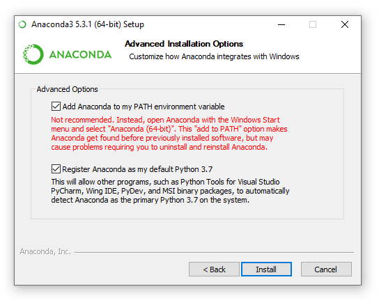

======================
PyMedPhys Installation
======================

.. contents::
    :local:
    :backlinks: entry

Install Python
==============

In order to make use of the PyMedPhys library, you'll need Python installed on
your workstation. On Windows we recommend that you install the
Anaconda Python distribution. Download the latest Anaconda **Python 3** (not 2)
version from `here <https://www.anaconda.com/download/>`__.

.. note::

    When installing Anaconda make sure to install it for your user only, and
    tick the option "add to path".

On Linux or MacOS we recommend not using your system Python and instead
managing your Python installation using something like `pyenv`_.

.. _`pyenv`: https://github.com/pyenv/pyenv-installer#install

OS specific extra steps
=======================

PyMedPhys uses a range of dependencies, most of which can be automatically
installed. However there are two libraries which need a few extra steps
depending on the OS you are using.

Extra step for Windows
----------------------

The ``electronfactors`` module makes use of the ``GEOS`` based package
``shapely``.
At this current point in time ``shapely`` cannot be installed directly from
pip on Windows. Instead you will be required to install shapely by downloading
the wheel from <https://www.lfd.uci.edu/~gohlke/pythonlibs/#shapely> and then
running the following command substituting in the name of the file you
downloaded:

.. code:: bash

    pip install ./Shapely‑1.6.4.post2‑cp37‑cp37m‑win_amd64.whl

Extra steps for MacOS
---------------------

Due to the ``pymssql`` dependency which is used to connect to Microsoft SQL
databases (such as Mosaiq) we need to follow some of their pre-install steps
(<http://www.pymssql.org/en/stable/intro.html#install>).

This in particular impacts MacOS where you will need to install both
``freetds`` and ``cython`` before installing
``pymedphys``. The easiest way to install ``freetds`` is via ``homebrew``.

So, do the following to install homebrew (as described at <https://brew.sh/>):

.. code:: bash

    /usr/bin/ruby -e "$(curl -fsSL https://raw.githubusercontent.com/Homebrew/install/master/install)"

Open a new shell, then run:

.. code:: bash

    brew install freetds

To install cython run:

.. code:: bash

    pip install cython

Extra steps for Linux
---------------------

There are none, because Linux is awesome.

Installing PyMedPhys
====================

Once ready, you can now install PyMedPhys via pip downloaded from PyPI:

.. code:: bash

    pip install pymedphys

Installing Bleeding Edge
========================

If you wish to be able to contribute to PyMedPhys itself you are going to want
to instead install PyMedPhys from the master branch on GitHub
<https://github.com/pymedphys/pymedphys>. To achieve this follow the OS
specific instructions within the contributor tutorials:

* :doc:`../contrib/tutes/setup-linux`
* :doc:`../contrib/tutes/setup-win`
* :doc:`../contrib/tutes/setup-mac`
