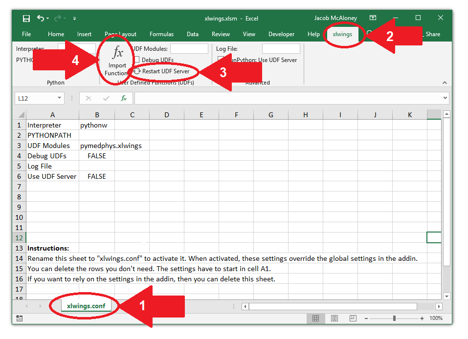

#############################
Excel integration via xlwings
#############################

xlwings is a powerful tool for implementing python script within Microsoft
Excel.

Installation of PyMedPhys and xlwings
-------------------------------------

Download and install the latest Anaconda Python 3 version from `here
<https://www.anaconda.com/download/>`__. This comes with xlwings included in
the installation. Follow xlwings' `guide on enabling UDFs within Excel
<https://docs.xlwings.org/en/stable/udfs.html>`__.

Setting up xlwings
------------------

If you wish to create a new xlwings file, use their template creation tool
documented athttps://docs.xlwings.org/en/stable/udfs.html#workbook-preparation.
Otherwise you can use some PyMedPhys example spreadsheets (work in progress).

Within the template file navigate to the "xlwings.conf" tab of the spreadsheet
(arrow 1 in below image) and ensure the interpreter and UDF modules are correct
(see image below for reference). Rename the sheet to xlwings.conf to activate
the file.

Now you can run Python scripts as defined in PyMedPhys in Excel. Whenever
changes occur or if things don’t appear to be working properly navigate to the
xlwings add-on tab in the Excel ribbon (arrow 2 in below image). Click on
"restart UDF servers" followed by "import functions", arrows 3 and 4
respectively in the below image. Then try to execute a function within the
Excel spreadsheet.

If a file path or reference has changed since the last time the Excel file
was saved functions running python within Excel may return false responses.
This is usually cleared by re-running a few functions which should trigger
the rest within the workbook to update.

