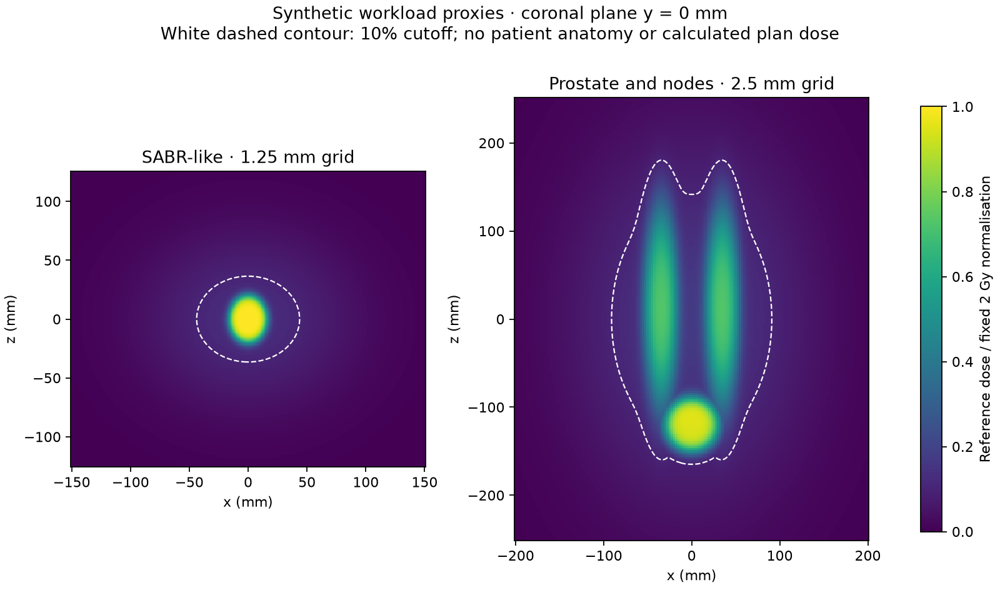

# Gamma performance: a two-hour workstation audit

This audit compares complete gamma calculations using **old and new PyMedPhys
source, each with the PyMedPhys and SciPy interpolators**. It records absolute
seconds, scaling curves and **PyMedPhys speed / SciPy speed**, checks the numerical
results and packages the evidence. All measurements run on one workstation.

The workflow has a fixed, calibrated scope and a **two-hour overall deadline**.
It includes a repeated scaling matrix and two larger synthetic volume examples.
“Old/new SciPy” means old/new gamma code using the same SciPy package version.

The [earlier notebook](gamma-performance.ipynb) explains the optimisation.
The [recorded workstation evidence](gamma-scaling-workstation/index.md) preserves
useful partial results from the earlier long run, including a 3D example taking
3 min 28 s with new PyMedPhys versus 18 min 5 s with SciPy. Those observations
use a different schedule and must not be pooled with the new audit.

## Start

Use Git, Python 3.12 and a checkout containing PR #2066. Both source revisions
must exist locally; a shallow clone may need a fetch. From the repository root:

```console
python -m pip install -r examples/gamma-scaling-requirements.txt
python examples/gamma_scaling_background.py --output gamma-audit-2h
```

Use a separate environment if those pinned dependencies would change packages
you need elsewhere. On Windows, the existing repository environment can be used
as `.\.venv\Scripts\python.exe` in place of `python`.

The command returns immediately and the audit runs in the background. You can
close the terminal. Keep the workstation awake, connected to power and free of
other heavy computation; the script does not change power settings.

The launcher freezes scripts, package versions and exact source identifiers:
previous main `866f83edad8586a42a739094e488f45242b72c95` and committed `HEAD` by
default. Uncommitted library edits are not measured. Use `--current-ref`,
`--previous-ref` or `--threads` on the initial launch to change these settings.
Four Numba threads are used by default; OMP, OpenBLAS and MKL use one thread.
The 1.5 GiB RAM chunk budget is not a process memory limit.

**Use a new output directory.** Older runs contain frozen runners without the
new audit plan. Runs without an overall deadline cannot be resumed by this
launcher. Keep the Python environment unchanged while a run is active.

A small installation check, separate from the audit:

```console
python examples/gamma_scaling_background.py --quick --output gamma-audit-check
```

This exercises all six ordinary dimension/criterion combinations and four
variants at small sizes, with one round. It does not exercise the large volume
examples or support the full audit claim.

## A fixed scope that fits the budget

| Stage | Scope | Maximum allowance |
| --- | --- | ---: |
| Calibration | Up to three probes for each of six dimension/criterion families | 13.5 min |
| Repeated matrix | 2D/3D × three criteria × three sizes × four balanced rounds | 54 min |
| SABR-like volume | One four-way comparison at the specified 1.25 mm grid | 20 min |
| Prostate and nodes | One four-way comparison at the specified 2.5 mm grid | 20 min |
| Remaining allowance | Git setup, checkpoints, reporting, packaging and scheduling margin | 12.5 min |

Every comparison allowance includes all four workers' imports, data preparation,
**full warm-ups**, timed calls and array verification. An ordinary comparison
has a shared **45-second limit**, not 45 seconds per implementation. Eleven seconds
of each limit are reserved for process termination and final checkpoint work.
The larger examples each have a shared 20-minute limit. These are benchmark
budgets, not predictions of an individual gamma-call time.

Calibration chooses the largest tested size finishing within **25 seconds** for
each family. There are at most three attempts, increasing or reducing nominal
point count by a factor of three. The three measured sizes are that selected
size divided by nine, divided by three and unchanged. Their shapes must be
distinct. Sizes can differ between criteria; each four-way group always uses
identical inputs. Do not compare different families as though grid size were
controlled. Calibration observations are retained separately and excluded from
the reported audit statistics.

After calibration, `audit-plan.json` freezes **74 four-way groups**: 72 repeated
matrix groups plus two single-round volume examples. A complete run contains
**296 timed calls and 296 full warm-ups**, in addition to calibration. Matrix
cases cover smaller sizes first and all six families in each round. Each
ordinary case has four rounds balancing execution position and immediate
predecessor across the four variants. The volume examples have only one round;
they illustrate absolute waiting time without estimating repeatability.

A slow or busy machine may fail calibration; the audit then stops early with a
diagnostic instead of launching an impractical matrix. Unexpected slowdowns,
errors or a volume case exceeding its limit produce explicitly incomplete
coverage. **Completed means every planned group passed its numerical checks.**
`routine_complete` separately reports whether all 72 ordinary groups finished.
No workflow can guarantee successful measurements on arbitrary hardware while
also imposing a hard deadline; the runtime limit takes precedence.

The independent supervisor enforces the two-hour wall-clock limit, including
reporting and ZIP creation. Measurements stop two minutes before that deadline;
a watchdog interrupts a stalled driver or worker tree during finalisation.
`--max-seconds` can shorten the total allowance (5–7200 seconds), for diagnostics;
shortening it does not shrink the fixed audit scope. `--worker-timeout` can
shorten an individual worker allowance but cannot extend a group or total limit.
The unrestricted foreground `gamma_scaling.py` sweep remains available for
specialist experiments and does not provide this launcher's two-hour guarantee.

## The workloads and their interpretation

The repeated matrix samples the same continuous field at different resolutions:
two Gaussian-blurred boxes and a smaller boost, with 6 mm Gaussian standard
deviation. The domain is ±100 mm along both 2D axes, or ±50, ±70 and ±70 mm along
3D `(z, y, x)`. Baseline shapes are 401 × 401 and 41 × 57 × 57; a point multiplier
scales each axis by its dimension's root and rounds down. Calibration is capped
at 100× baseline points. Small calibrated grids are computational test cases,
not clinical dose-grid recommendations. The 2D field is a separate workload,
not a slice of the 3D field.

| Matrix profile | Dose and distance criteria | Search cap |
| --- | --- | --- |
| Global | 3% of fixed 2 Gy normalisation; 3 mm | Unset |
| Capped global | The same global criteria | `max_gamma=2` |
| Local | 2% of each reference dose; 2 mm | Unset |

The supplied global normalisation is exactly 2 Gy; sampled maxima are not
rescaled. Points at or above 0.2 Gy are included. Both revisions receive
identical ascending, regularly spaced, coincident float64 grids. Evaluation
is scaled by 1.02 and translated by (1.5, −2.0) mm in 2D or
(1.5, −2.0, 0.75) mm in 3D. There is no random subset or early exit simply because
gamma passes. `interp_fraction=10` controls search sampling, not input spacing.
The local case changes normalisation and criteria together, so it cannot isolate
either factor's cost. A cap need not save time when gamma already finishes below it.

### Two volume examples motivated by clinical workflows

Grid spacing is only part of the workload. Physical extent determines total
voxels; dose distribution and cutoff determine how many reference points need
searching. Gradients, dose differences and search settings also affect cost.
A finely sampled SABR grid can contain more voxels but fewer eligible reference
points than a coarser pelvic grid.

| Synthetic example | Centre-to-centre extent (z, y, x) | Isotropic spacing | Shape (z, y, x) | Total voxels |
| --- | --- | --- | --- | ---: |
| SABR-like compact target | 250 × 300 × 300 mm | 1.25 mm | 201 × 241 × 241 | 11,674,281 |
| Prostate and pelvic nodes | 500 × 400 × 400 mm | 2.5 mm | 201 × 161 × 161 | 5,210,121 |

These extents are explicit illustrative assumptions, not claimed typical patient
sizes. The SABR proxy has a compact smooth ellipsoid with semi-axes
(20, 18, 16) mm and a 3 mm edge-smoothing parameter. The pelvic proxy has a prostate-like
ellipsoid centred at z = −120 mm with semi-axes (30, 25, 30) mm, plus bilateral
elongated ellipsoids with semi-axes (110, 18, 18) mm and 70% amplitude, centred at
(15, 5, ±35) mm. Its edge-smoothing parameter is 6 mm. Smoothing is referenced
to the shortest semi-axis; transitions along longer axes are broader. Both include a broad Gaussian
low-dose component; the exact analytic definitions are frozen in
`gamma_scaling_worker.py`. They contain no patient anatomy or calculated plan dose.
The 2 Gy amplitude is a benchmark normalisation, not a treatment prescription.

Both use global **3%/2 mm**, a 10% cutoff, the same shifts and scaling as the
matrix, and no gamma cap. These common benchmark settings draw on
[AAPM TG-218](https://aapm.onlinelibrary.wiley.com/doi/10.1002/mp.12810);
they are not proposed site-specific acceptance criteria for SABR or prostate QA.
The report includes total and eligible voxel counts. The old stress-test field
at approximately 0.53 mm spacing must not be treated as a substitute for these
workloads, nor should a universal 3D speed ratio be assumed in advance.



This figure shows the reference fields in the coronal plane at y = 0 mm.
The white contour marks the 10% dose cutoff. Regenerate it without gamma calls
by importing `save_scenarios` from `examples/gamma_performance_audit.py`.

## Timing, numerical checks and ratios

Each fresh worker imports one verified source checkout, performs a complete
untimed warm-up and then times one complete gamma call. Imports, input generation,
initial compilation/cache loading, verification and file writing are excluded
from the reported gamma-call seconds but count towards wall-clock budgets.
Preparation inside gamma is included. These measurements describe warmed use,
not the first-ever wait. Changing resolution also changes discretisation and
interpolation error, so the curves are not a pure complexity experiment.

Every timed array must exactly match its warm-up. Old/new gamma arrays and NaN
positions must match exactly for each interpolator. PyMedPhys/SciPy arrays are
compared element by element with absolute tolerance `1e-10` in dimensionless
gamma and zero relative tolerance. Maximum difference and pass-classification
disagreements are recorded. This arithmetic allowance is not a physical or
clinical tolerance. Every eligible point must have finite gamma. Hashes record
provenance but do not replace full-array comparisons.

Only fully verified four-way groups contribute to the comparison figures:

- Absolute times: seconds on logarithmic axes, with observed minimum–maximum.
- Effect of this change: paired new time / old time within each interpolator.
- Interpolator speed: **SciPy time / PyMedPhys time**, equal to PyMedPhys speed /
  SciPy speed. Values above one favour PyMedPhys.

Ratios are calculated within each matched round, then summarised; the median
ratio need not equal the ratio of the two absolute medians. Ranges are observed
variation, not confidence intervals. One-round volume cases have no repeatability
range. Do not pool workloads into one overall speed-up or extrapolate missing
measurements. A timed-out worker contributes no invented timing or ratio;
successful calls from its unfinished group remain in the raw record, labelled
unverified for four-way comparison.

## Progress, stopping, resuming and upload

```console
python examples/gamma_scaling_background.py --status gamma-audit-2h
python examples/gamma_scaling_background.py --stop gamma-audit-2h
python examples/gamma_scaling_background.py --resume gamma-audit-2h
```

`run.log` reports calibration, the active case, implementation and completed
timings. On Windows, follow it with
`Get-Content gamma-audit-2h/run.log -Tail 20 -Wait`.
Stopping interrupts the active worker and preserves checkpoints. Resume requires
the original source, frozen scripts, Python environment and host. **It does not
reset the deadline**; time while stopped still counts. An operating-system lock
prevents concurrent writers. Completed runs cannot be resumed accidentally.

When the supervisor is inactive, upload:

```text
gamma-audit-2h/gamma-scaling-upload.zip
```

The ZIP contains raw `study/results.json`, the frozen plan and calibration
record, individual and summary CSVs, speed-ratio CSV, PNG/SVG figures, the
results table, logs, package versions and benchmark sources. Large temporary
`.npy` arrays and compilation caches are excluded. Save the whole directory
locally if you may resume. Share the PNGs directly; screenshots are optional.

`completed` requires all 74 groups. `budget_exhausted`, `stopped` and `failed`
retain their explicit coverage limitations. If report generation is interrupted,
`report_complete` is false and stale derived figures are excluded from the ZIP.
If even packaging reaches the deadline, upload `study/results.json`,
`study/calibration.json`, `study/audit-plan.json` (where present), `run.json`
and `run.log` instead. The JSON remains the primary evidence for publication.
