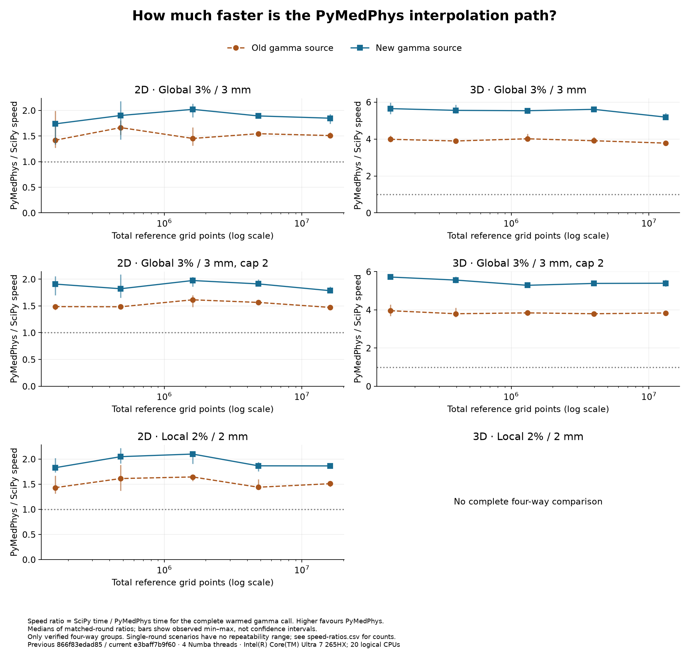
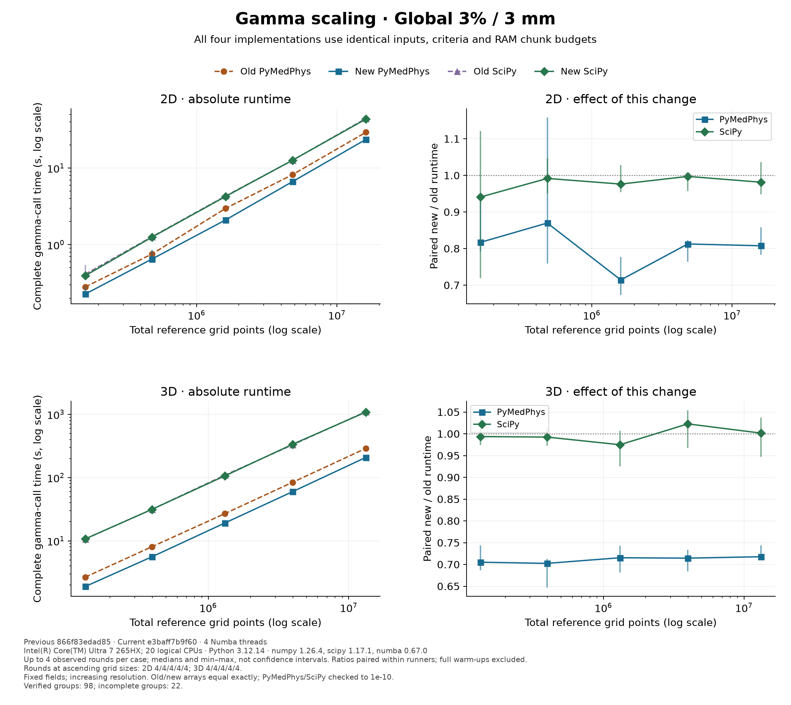
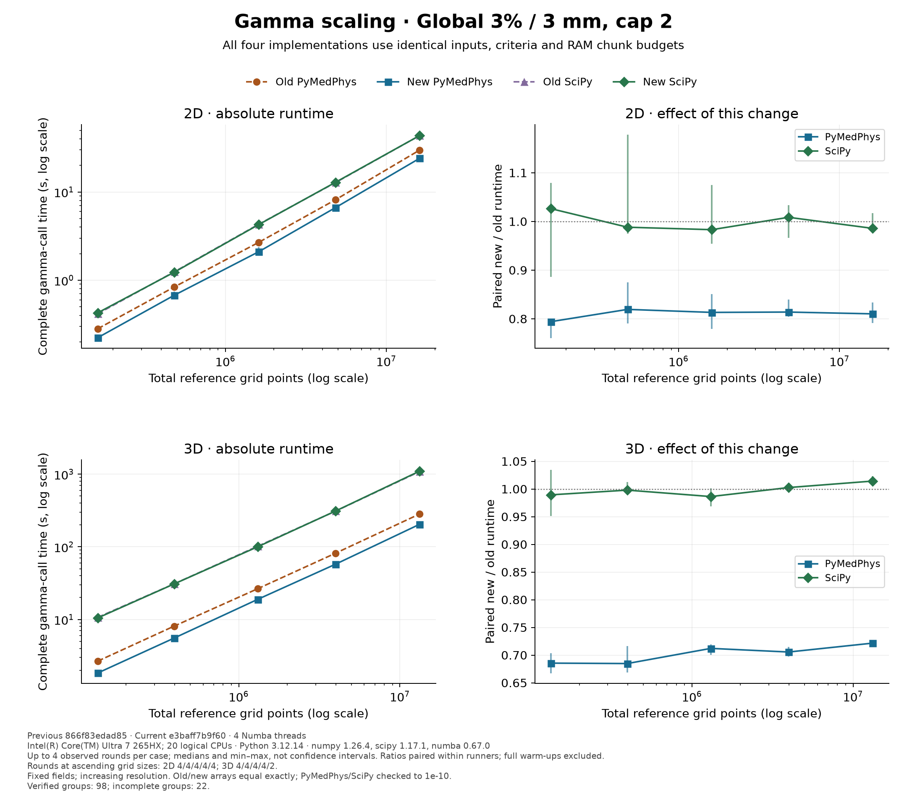
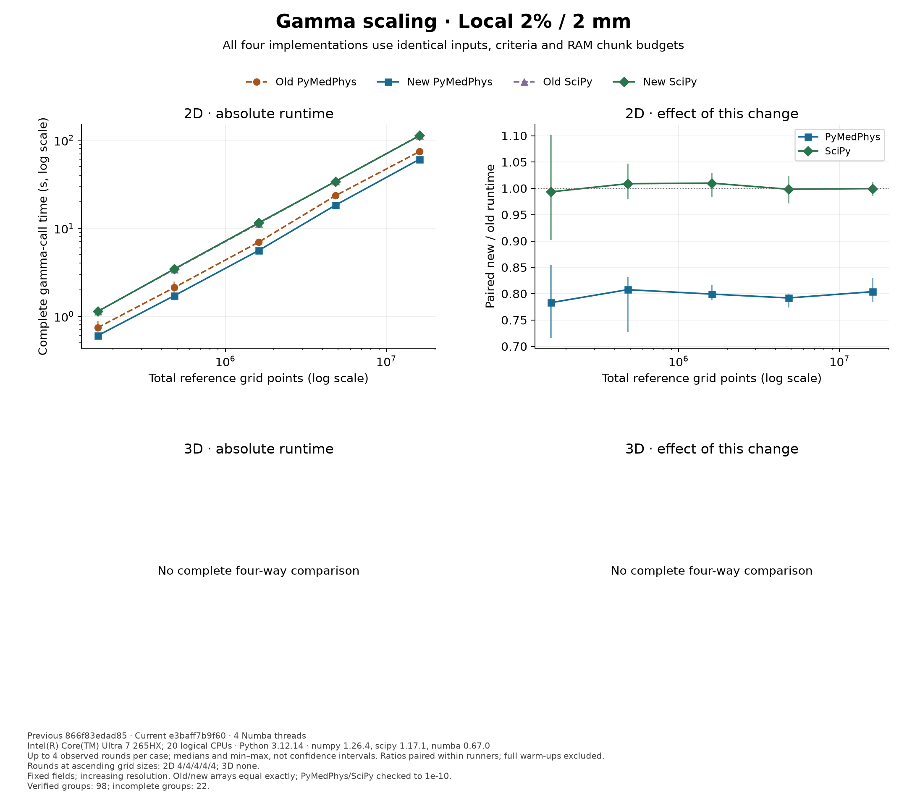

# Gamma scaling: recorded workstation evidence

**Partial study, recorded 26–27 September 2026.** These are saved workstation measurements from the original continuous-field scaling run, before the two-hour scheduler was introduced. They are distinct from the earlier fixed-grid notebook.

**98/120 planned four-way groups are verified**, giving 392 plotted timed calls across 25 workloads. The run was stopped; the missing groups are listed in the raw record. In particular, no 3D local-criterion case was reached.

## What the completed measurements show

At the largest 3D global grid (13,242,240 points), the PyMedPhys interpolation path used **28.2% less time** across four paired rounds. The corresponding capped case used **27.8% less time**, but only two rounds completed there, so its ordering is not fully balanced.

At the largest 2D grid (16,080,100 points), the global and local PyMedPhys paths used **19.2%** and **19.6%** less time respectively. These cases each have four paired rounds. The SciPy paths show much smaller, mixed changes; this run does not establish a consistent SciPy speed improvement.

The table gives **median absolute seconds per complete warmed gamma call** at the largest available size. It excludes full warm-ups, imports, initial compilation and verification. A small number of rounds describes observed variation, not a confidence interval or a guarantee on another workstation.

| Workload | Old PyMedPhys (s) | New PyMedPhys (s) | Old SciPy (s) | New SciPy (s) | Rounds |
| --- | ---: | ---: | ---: | ---: | ---: |
| 2D Global 3% / 3 mm | 29.30 | 23.66 | 44.43 | 43.60 | 4 |
| 2D Global 3% / 3 mm, cap 2 | 29.79 | 24.04 | 43.55 | 43.54 | 4 |
| 2D Local 2% / 2 mm | 74.30 | 60.64 | 113.01 | 112.24 | 4 |
| 3D Global 3% / 3 mm | 289.57 | 208.40 | 1100.55 | 1084.65 | 4 |
| 3D Global 3% / 3 mm, cap 2 | 282.84 | 204.10 | 1085.36 | 1101.15 | 2 |
| 3D Local 2% / 2 mm | Not measured | Not measured | Not measured | Not measured | 0 |

Percentages use `100 × (1 − median(new time / old time within each round))`. They need not equal percentages calculated by dividing the two absolute medians above. Ratios compare complete gamma calculations with a fixed SciPy version, not SciPy releases or an isolated interpolation kernel.

## PyMedPhys versus SciPy

**Speed ratio = PyMedPhys speed / SciPy speed = SciPy time / PyMedPhys time**, calculated within each matched round. A value of 5 means the PyMedPhys interpolation path completes gamma in approximately one fifth of the time. This compares full gamma calls with a fixed SciPy version and four Numba threads, not isolated interpolation kernels or SciPy releases.

| Measured workloads | Old gamma source: speed ratio | New gamma source: speed ratio |
| --- | ---: | ---: |
| 2D: all three criteria | 1.42–1.67× | 1.74–2.10× |
| 3D: global and capped global only | 3.78–4.01× | 5.19–5.72× |

These ranges span workload medians, not individual measurements or confidence intervals. The least favourable workload median was 1.42× for the old source and 1.74× for the new source, both on the smallest 2D global grid. Individual rounds varied more: minima were 1.27× and 1.33× respectively. No single multiplier describes both 2D and 3D.

The largest fully repeated 3D global case gives a practical waiting-time example: **new PyMedPhys 3 min 28 s versus SciPy 18 min 5 s**, a median paired speed ratio of **5.19×**. Old PyMedPhys took 4 min 50 s versus SciPy 18 min 21 s, a ratio of 3.78×. The numerical comparisons passed. These are warmed-call times; first-use compilation and the audit's full warm-ups add to elapsed time.

That case samples a **100 × 140 × 140 mm synthetic volume at approximately 0.53 mm spacing**. Its 13.2 million voxels are not evidence of clinical representativeness: dose extent, above-cutoff volume, gradients, criteria and mismatch affect gamma cost. The [completed uncertainty audit](../gamma-uncertainty-workstation/index.md) separately measures synthetic SABR-like and prostate/nodal workloads at specified 1.25 mm and 2.5 mm spacings, and tests runtime-model accuracy. Do not infer their timings from these curves or pool the two sessions.



Download [paired speed-ratio summaries](speed-ratios.csv). These ratios were independently recalculated from the raw observations when generating this page.

## Coverage and numerical checks

All 15 2D workloads (three criteria × five sizes) and all five 3D global workloads completed four rounds. The 3D capped workloads completed four rounds through 30× and two rounds at 100×. All five 3D local workloads are missing. Coverage therefore depends on the original scheduling order and computation cost; do not infer a single overall speed-up, impute missing timings or extrapolate a 3D local result.

The controller recorded exact old/new gamma-array equality for each interpolator in every plotted group, including NaN positions. All 393 successfully timed calls matched their full warm-ups exactly. One successful call belongs to an unfinished group and is excluded from plots; the interrupted call supplies no timing. The maximum recorded PyMedPhys/SciPy absolute gamma difference was **3.93e-13**, below `1e-10`; the recorded gamma-pass classification disagreement count was **0**. These are numerical checks on synthetic fields, not clinical validation.

The raw records and paired calculations were checked again when constructing this page. Large gamma arrays were removed by the original runner after their full comparisons; recreating those array comparisons requires rerunning the corresponding workloads.

## Scaling curves

Left panels show absolute seconds on logarithmic axes; right panels show matched-round new/old ratios. Bars span observed minimum to maximum. Each plotted point includes all four variants for the same completed rounds. Missing 3D local measurements remain explicitly blank.







## Source and reproducibility

Hardware: **Intel(R) Core(TM) Ultra 7 265HX; 20 logical CPUs**; Windows-11-10.0.26200-SP0; Python 3.12.14. Packages: numpy 1.26.4, scipy 1.17.1, numba 0.67.0. Four Numba threads; OMP, OpenBLAS and MKL each limited to one thread. The fixed 1.5 GiB chunk budget is not a process memory limit.

Compared source: [previous `866f83edad85`](https://github.com/pymedphys/pymedphys/commit/866f83edad8586a42a739094e488f45242b72c95) and [current `e3baff7b9f60`](https://github.com/pymedphys/pymedphys/commit/e3baff7b9f6047bff77ea4603623540f5eecf45a). The raw record also contains worker/driver hashes, input/output hashes, import origins, thread settings and per-call timestamps.

Same-host pairing controls hardware identity, but CPU affinity was not pinned and load, power state and thermal conditions were not controlled or recorded. This lengthy sequential run is not an independent repeat on several workstations. Within-round pairing and balanced ordering reduce some drift effects without eliminating them.

The [study guide](../gamma-performance-study.md) describes the continuous synthetic fields and gamma criteria. The original schedule used five sizes (1, 3, 10, 30 and 100×), four rounds and case-first ordering. The newer audit calibrates a fixed matrix and adds two separate volume examples; it cannot retrospectively make this a complete study.

Download the [raw checkpoint (gzip-compressed JSON)](results.json.gz), [individual timings](timings.csv) or [absolute timing summary](summary.csv). The checkpoint preserves all records, including the unverified and interrupted calls; only verified groups contribute to the figures.

SHA-256 of the uncompressed checkpoint: `16ad7caba42e17d054759803e5d0b08acb8383ea98401e29debd5f4ba1dbd5dc`.

Regenerate this page and its figures from the repository root, without running gamma:

```console
python examples/gamma_scaling_evidence.py --input lib/pymedphys/docs/contrib/info/gamma-scaling-workstation/results.json.gz --output gamma-scaling-evidence-rebuilt
```
