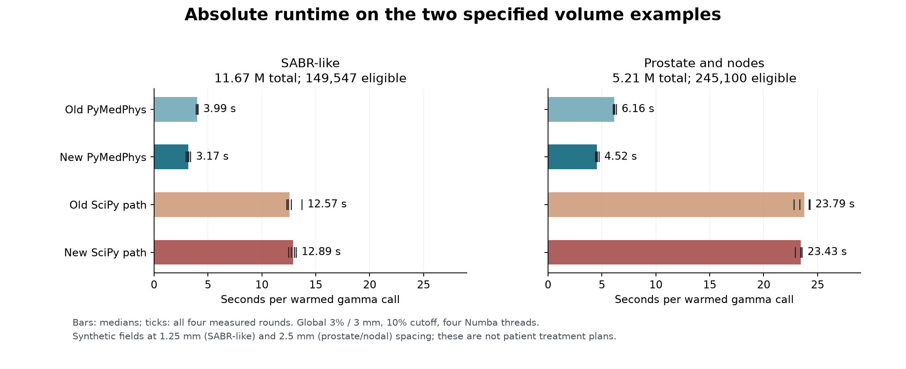
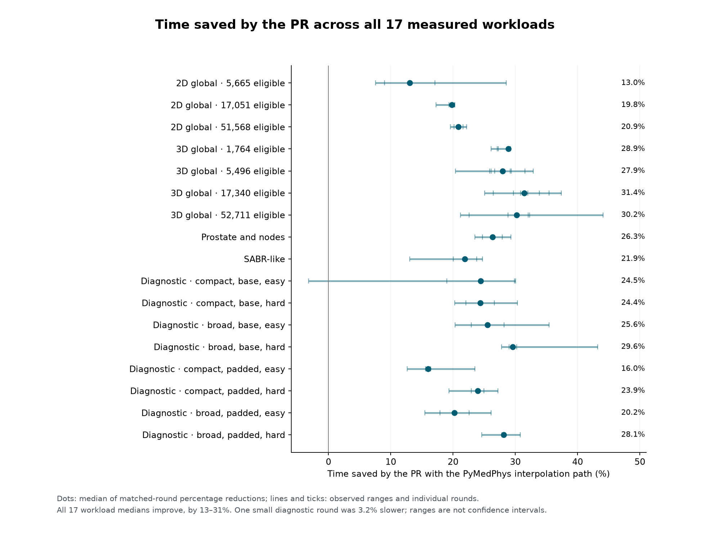
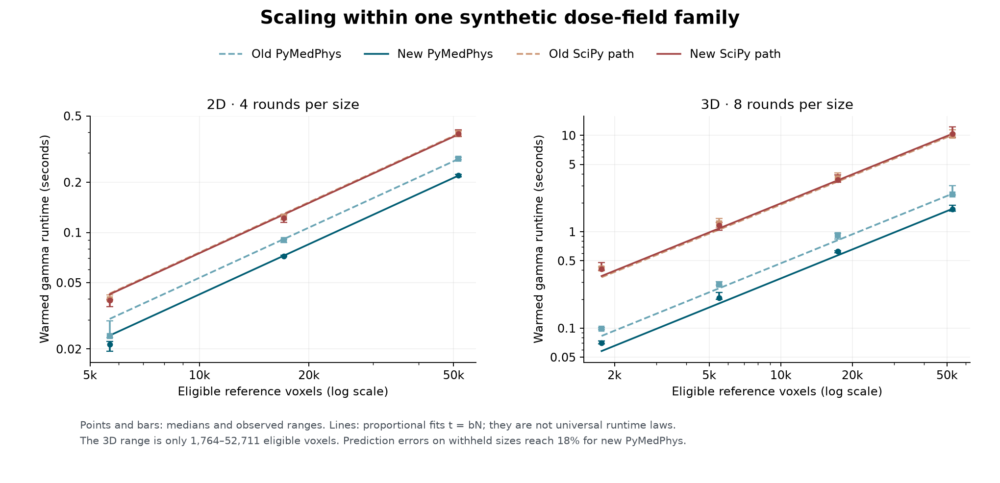
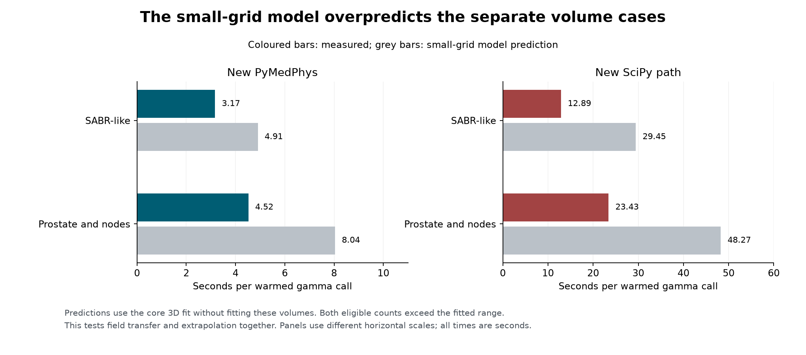
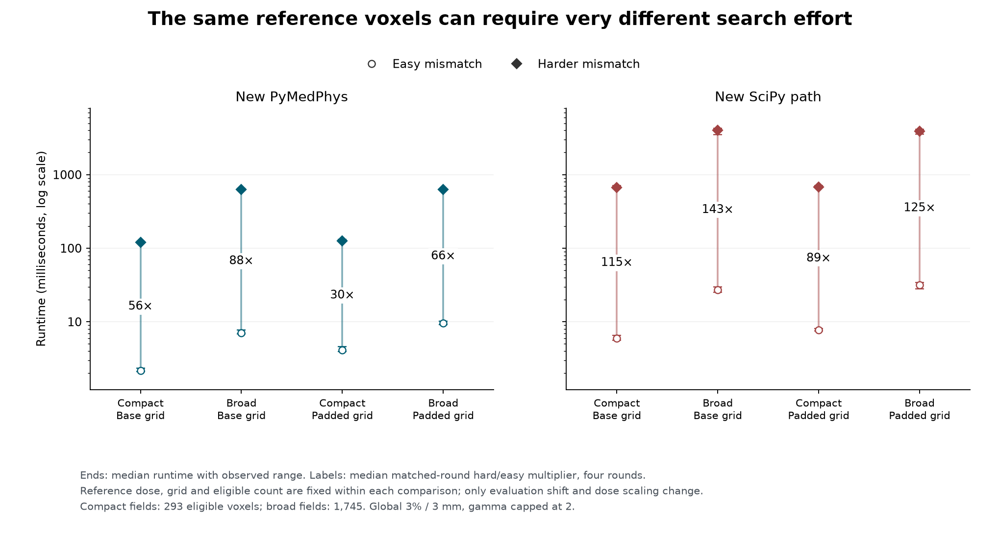
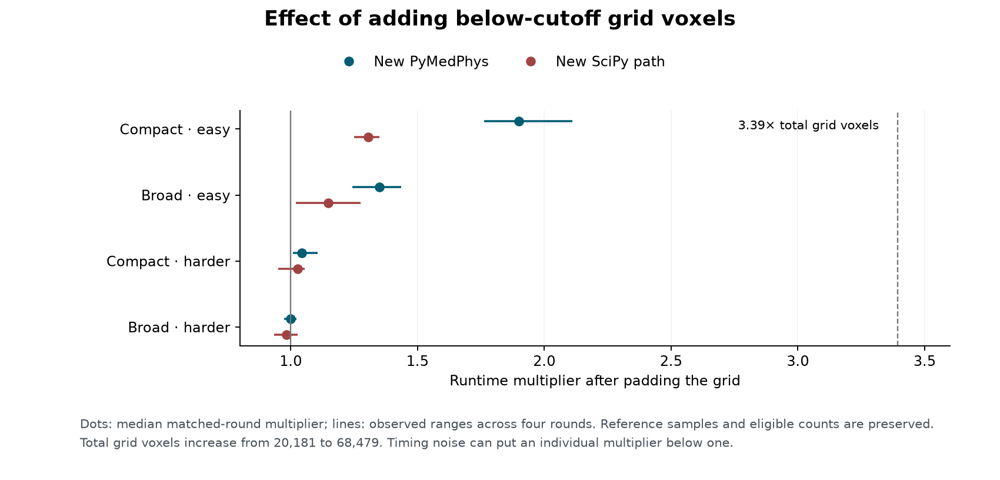

# Gamma performance: a completed workstation audit

**Recorded 27 September 2026; completed in 42 min 37 s.** All 84 planned
four-way comparison groups completed: **336 verified timed calls across
17 synthetic workloads**, with a full warm-up before each timed call.

The results support a reduction in gamma runtime from PR #2066 and a substantial
advantage for the PyMedPhys interpolation path on this workstation. They also
show why a runtime prediction based only on the number of voxels can be wrong.
These are synthetic computational experiments, including two volumes with the
requested dose-grid dimensions and spacings. They do not establish performance
on patient treatment plans.

## Absolute waiting times for the larger volumes

The two volume examples use global **3% / 3 mm gamma**, a 10% reference-dose
cutoff, fixed 2 Gy normalisation and `interp_fraction=10`. Every eligible
reference voxel is evaluated, without a random subset or early stopping on a
pass. The "Two volume examples motivated by clinical workflows" section of the
[study guide](../gamma-performance-study.md) describes the field construction
and limitations.

| Synthetic volume | Shape | Isotropic spacing | Total voxels | Above-cutoff voxels |
| --- | --- | ---: | ---: | ---: |
| SABR-like | 201 × 241 × 241 | 1.25 mm | 11,674,281 | 149,547 (1.28%) |
| Prostate and nodes | 201 × 161 × 161 | 2.5 mm | 5,210,121 | 245,100 (4.70%) |

The SABR-like grid spans 250 × 300 × 300 mm between its outermost voxel centres;
the prostate/nodal grid spans 500 × 400 × 400 mm. The latter has fewer total
voxels but more above the cutoff, and takes longer. Both the dose distribution
and the search needed to match it matter.



| Median warmed time | Old PyMedPhys | New PyMedPhys | Old SciPy path | New SciPy path |
| --- | ---: | ---: | ---: | ---: |
| SABR-like | 3.99 s | **3.17 s** | 12.57 s | 12.89 s |
| Prostate and nodes | 6.16 s | **4.52 s** | 23.79 s | 23.43 s |

Each value is the median of four complete gamma calls. Times exclude imports,
initial compilation, dose-array generation, full warm-ups and verification.
Consequently, the elapsed time to run the audit is longer than the sum of these
timings, and a first gamma call can take longer.

Here, **speed ratio = PyMedPhys speed / SciPy speed = SciPy time / PyMedPhys
time**. Calculate this ratio within each matched round, then take its median:

| Volume | Old source | New source | Observed new-source range |
| --- | ---: | ---: | ---: |
| SABR-like | 3.15× | **4.07×** | 3.67–4.46× |
| Prostate and nodes | 3.84× | **5.15×** | 4.96–5.29× |

These compare the two interpolation paths within a **complete PyMedPhys gamma
calculation**, using one fixed SciPy package version. “Old/new SciPy” refers to
the old/new gamma source using SciPy. Four Numba threads were used for the
PyMedPhys path; this is the recorded configuration, not a thread-normalised
kernel comparison. The ranges describe four observations, not confidence
intervals.

## How much improvement comes from this PR?

For the two volumes, the PR reduces the PyMedPhys path's warmed time by
**21.9% and 26.3%**, respectively. Across all 17 workloads, the median reduction
ranges from **13.0% to 31.4%**. The 4–5× advantage over SciPy includes an
advantage already present in the old code; it should not all be attributed to
this PR.



The plotted reduction is the median of `100 × (1 − new time / old time)`
within each round. This need not equal a percentage calculated from the two
absolute medians in the table. Every workload median improved, although one
round of a small diagnostic workload was 3.2% slower. SciPy-path changes were
small and mixed; this audit does not establish a consistent SciPy-path gain.

## A useful linear model within a specified workload

An *eligible voxel* is a reference voxel whose dose is at or above the cutoff.
Let $M$ be the number of eligible voxels divided by one million. Two simple
models were fitted to the median time at each size:

- **Proportional:** $t=bM$, with time $t$ in seconds.
- **With an offset:** $t=a+bM$, allowing a fixed setup cost $a$.

Each size contributes one median to an ordinary least-squares fit in seconds.
The plots use logarithmic axes to display the size range; the regression itself
does not fit logarithms.



The 3D family has four sizes, **1,764–52,711 eligible voxels**, with eight rounds
per size. Its proportional slopes are:

| Gamma path | Seconds per million eligible voxels | Exploratory 95% repeat interval |
| --- | ---: | ---: |
| Old PyMedPhys | 47.07 | 46.30–47.93 |
| New PyMedPhys | **32.80** | 32.22–35.50 |
| Old SciPy path | 191.17 | 187.70–207.84 |
| New SciPy path | **196.95** | 189.09–200.67 |

The new ratio of fitted slopes is **6.00×**, with an exploratory repeat interval
of **5.66–6.15×**. This ratio of slopes differs from taking the median of paired
speed ratios. For 2D, three sizes and four rounds give slopes of 4.25 and
7.51 s/million for new PyMedPhys and SciPy, a fitted ratio of **1.77×**; no repeat
interval is reported with only four rounds.

For the new 3D paths, including an offset gives
$t_{\mathrm{PyMedPhys}}=0.0351+31.93M$ and
$t_{\mathrm{SciPy}}=0.0722+195.16M$. Adding an offset does not automatically
improve prediction. When one entire size is withheld from fitting, the maximum
absolute prediction errors are:

| New 3D path | Proportional model | Model with offset |
| --- | ---: | ---: |
| PyMedPhys | 18.0% | 52.9% |
| SciPy | 15.3% | 2.7% |

With only four sizes, these are useful stress tests, not comprehensive
out-of-sample validation. The repeat intervals use 4,000 bootstrap samples of
whole rounds, preserving pairing between sizes and variants. They describe
repeat-timing uncertainty for these particular workloads, conditional on the
rounds being exchangeable. They are **not prediction intervals** for another
dose field or workstation. The new PyMedPhys slope was 6.8% lower in the later
half of the session than the earlier half, so drift also limits this assumption.
Its cause was not measured.

## Does the model predict the separate volumes?

The two volume cases were excluded from fitting. Applying the small-grid
proportional model overpredicts their runtimes substantially:



| Volume | New PyMedPhys: predicted / measured | Overprediction | New SciPy: predicted / measured | Overprediction |
| --- | ---: | ---: | ---: | ---: |
| SABR-like | 4.91 / 3.17 s | **55%** | 29.45 / 12.89 s | **128%** |
| Prostate and nodes | 8.04 / 4.52 s | **78%** | 48.27 / 23.43 s | **106%** |

Both volumes also exceed the fitted eligible-count range. This therefore tests
**transfer to a different field and extrapolation together**; the audit cannot
separate their contributions. A precise fitted slope can still give an
inaccurate prediction when the workload changes.

The [earlier large-grid study](../gamma-scaling-workstation/index.md) found a
new-source fitted ratio of about 5.24× over 60,101–6,149,042 eligible 3D voxels.
There is **no overlap** with this audit's core 3D eligible-count range. These
studies have different sessions and coverage; the 5.66–6.15× interval above
does not refine the uncertainty of the earlier 5.24× estimate. Their records
and conclusions are kept separate.

## Why voxel count alone cannot determine runtime

Eight diagnostic workloads vary field width, grid padding and dose mismatch.
They use small, coarse grids to isolate computational effects, with global
3% / 3 mm gamma capped at 2. These grids are not clinical sampling
recommendations.

Within each easy/harder pair, the reference dose, grid and eligible count are
identical. The evaluation-dose displacement changes from
(0.375, −0.5, 0.1875) mm to (4, −5, 2) mm, and its dose multiplier changes
from 1.005 to 1.08. Both changes occur together, so their individual effects
cannot be separated.



The harder mismatch takes **30–88× longer with new PyMedPhys**, and
**89–143× longer through new SciPy**, using median matched-round multipliers.
This is direct evidence that a fixed voxel count can require very different
amounts of gamma search. The effect is large even though the harder cases
still complete in seconds on these small grids.

In a separate comparison, padding increases the total grid from 20,181 to
68,479 voxels (**3.39×**) while preserving spacing, the existing dose samples
and the eligible count. The added samples are below the cutoff.



For easy mismatches, padding increases new PyMedPhys time by about **35–90%**.
For harder mismatches, its median effect is about **0–4%**. This is consistent
with full-grid overhead being appreciable for very short calls, while search
work dominates harder comparisons. The measurements do not uniquely identify
each internal cost. Changing field width also changes its spatial distribution,
so it is not a pure intervention on the eligible count.

A useful working explanation is:

$$
t \approx t_{\mathrm{setup}} + t_{\mathrm{grid}}
  + (\mathrm{cost\ per\ interpolation\ query})
    (\mathrm{number\ of\ queries}).
$$

Gamma searches progressively larger distances and removes resolved reference
points from further searching. The required queries therefore depend on dose
agreement, gradients, criteria and search settings as well as voxel count.
**Query counts were not measured here**; they are a candidate explanatory
variable for a future model, rather than a fitted result of this audit.

## Coverage, numerical checks and provenance

The completed schedule contains 32 core 3D groups, 12 core 2D groups, 32
diagnostic groups and eight volume groups. Calibration is excluded from the
336 main timed observations. All planned main groups are present. This focused
uncertainty audit does not include local gamma or every criterion covered by
the separate coverage-oriented audit design.

The runner recorded exact old/new gamma-array equality for each interpolation
path, and exact agreement between each timed result and its warm-up. The
largest recorded PyMedPhys/SciPy absolute gamma difference was
**2.59 × 10⁻¹⁴**, with **zero gamma pass/fail classification disagreements**.
These are numerical checks on the sampled synthetic workloads.

For publication, all 17 input sets were independently regenerated: dose-array
hashes, total/eligible counts and gamma settings matched. The archived runner
hashes and pinned source were checked, the saved model report was reproduced,
and the fitted coefficients and paired ratios were independently recalculated.
The original full gamma arrays were removed after the runner's comparisons;
gamma itself was not rerun during publication review. The numerical findings
above therefore rely on the recorded full-array checks.

The comparison used [old source `866f83edad85`](https://github.com/pymedphys/pymedphys/commit/866f83edad8586a42a739094e488f45242b72c95)
and [new source `9b3a8aa00b75`](https://github.com/pymedphys/pymedphys/commit/9b3a8aa00b752fd70bd92acd6d24f1089288dde5).
Hardware was an **Intel Core Ultra 7 265HX**, 20 logical CPUs, Windows 11
build 26200, Python 3.12.14, NumPy 1.26.4, SciPy 1.17.1 and Numba 0.67.0.
Numba used four threads; OMP, OpenBLAS and MKL each used one. The gamma RAM
chunk budget was 1.5 GiB, which is not a process-memory limit.

The same host and balanced within-round ordering reduce hardware and ordering
confounds. CPU affinity, background load, power state and thermal conditions
were not controlled or logged. This is one session on one workstation;
repeat intervals do not establish cross-machine reproducibility.

## Inspect or reproduce the evidence

- [Raw checkpoint, gzip-compressed JSON](results.json.gz) and [provenance](provenance.json).
- [All timed observations](timings.csv), [absolute summaries](summary.csv),
  [paired speed ratios](speed-ratios.csv) and [PR time reductions](pr-benefit.csv).
- [Model coefficients](model-coefficients.csv), [complete model analysis](uncertainty.json)
  and [diagnostic paired effects](diagnostic-effects.csv).

SHA-256 of the uncompressed checkpoint:
`42c959f1757d4bdd156f83ce77ac2414b7108a2b1f14c962090643f89673688e`.
The original upload's SHA-256 is retained in the provenance file.

With the dependencies from the "Start" section of the
[study guide](../gamma-performance-study.md) installed, rebuild these figures and tables from the repository root, without rerunning
gamma:

```console
python examples/gamma_uncertainty_evidence.py --input lib/pymedphys/docs/contrib/info/gamma-uncertainty-workstation/results.json.gz --output gamma-uncertainty-evidence-rebuilt
```

The generator verifies the pinned checkpoint and calculations. It leaves this
authored explanation untouched. To collect a fresh audit on another workstation,
follow the runtime-model uncertainty design in the
[two-hour workflow](../gamma-performance-study.md) and retain its separate
provenance and results.
