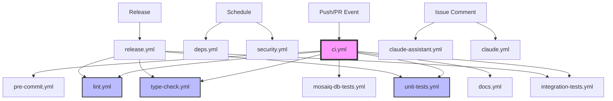

# PyMedPhys CI/CD Workflows

## Overview

PyMedPhys uses GitHub Actions for continuous integration and deployment. The workflow architecture follows a modular design with separated concerns for better visibility and maintainability.

## Workflow Architecture



## Workflow Structure

### Core Workflows (Run on All PRs)

#### `ci.yml` - Main Orchestrator
Coordinates all CI checks based on file changes, labels, and event types.

- **Triggers**: Push to main, pull requests, workflow_call
- **Jobs**:
  - `changes`: Detects file changes using path filters
  - `pre-commit`: Auto-formatting and basic checks
  - `lint`: Code quality (always runs)
  - `type-check`: Static type checking (always runs)
  - `unit-tests`: Fast unit tests (always runs)
  - `integration-tests`: Extended tests (conditional)
  - `mosaiq-db-tests`: Database tests (conditional)
  - `docs-check/publish`: Documentation (conditional)
  - `cypress-e2e`: E2E tests (main only)
  - `summary`: Generates comprehensive report

#### `pre-commit.yml`
Runs pre-commit hooks for code formatting and basic checks.

- **Features**:
  - Auto-fixes issues on PRs
  - Commits fixes automatically with bot account
  - Caches pre-commit environments

#### `lint.yml`
Dedicated linting workflow for code quality.

- **Jobs**:
  - `ruff`: Fast Python linter and formatter
  - `pylint`: Comprehensive Python linting
- **Always runs on PRs** for early issue detection

#### `type-check.yml`
Static type checking for type safety.

- **Jobs**:
  - `pyright`: Primary type checker
  - `mypy`: Secondary checker (optional/non-blocking)
- **Always runs on PRs** to ensure type safety

#### `unit-tests.yml`
Fast unit tests with smart matrix strategy.

- **Features**:
  - Full OS matrix on main (Ubuntu, Windows, macOS)
  - Quick mode for PRs (Ubuntu +  latest supported Python version)
  - Excludes slow tests for rapid feedback
  - JUnit XML report generation

### Extended Workflows (Conditional)

#### `integration-tests.yml`
Comprehensive testing beyond unit tests.

- **Test Types**:
  - `doctests`: Documentation code examples
  - `slow-tests`: Long-running integration tests
  - `stackoverflow`: Example code validation
  - `wheel-build`: Package build verification
  - `propagate`: Propagation script tests
- **Triggers**: Main branch or `full-test` label

#### `mosaiq-db-tests.yml`
SQL Server integration tests for Mosaiq database functionality.

- **Service**: SQL Server 2022 container
- **Triggers**: Database code changes or `database` label
- **Features**: Automatic retries for connection stability

#### `docs.yml`
Builds and deploys documentation to GitHub Pages.

- **Modes**:
  - `docs-check`: Build verification on PRs with doc changes
  - `docs-publish`: Deploy to GitHub Pages on main
- **Deployment**: docs.pymedphys.com

### Release & Maintenance

#### `release.yml`
Handles PyPI package publishing with quality gates.

- **Quality Checks**: Runs lint, type-check, unit, and integration tests
- **Features**:
  - TestPyPI dry-run capability
  - PyPI trusted publishing (no API tokens)
  - Automatic release asset upload
  - Installation verification

#### `security.yml`
Enhanced security scanning and vulnerability detection.

- **Scans**:
  - `secrets-scan`: API key exposure detection
  - `dependency-audit`: pip-audit for vulnerabilities
  - `python-security`: Bandit security linting
  - `container-scan`: Trivy filesystem scanning
  - `github-actions-security`: Workflow security patterns
- **Schedule**: Weekly + on main pushes + PR changes

#### `deps.yml`
Automated dependency updates.

- **Schedule**: Weekly (Mondays)
- **Features**:
  - Creates PR with uv lock updates
  - Includes changelog in PR description
  - Runs tests before creating PR

### AI Assistance

#### `claude.yml`
Claude Code integration for automated code assistance.

- **Triggers**: Comments with `@claude` mention
- **Capabilities**: Code review, issue analysis, PR creation
- **Tools**: File operations, git, uv package management

#### `claude-assistant.yml`
Claude chatbot for issue discussions.

- **Triggers**: Comments with `!claude` mention
- **Features**:
  - Rate limiting protection
  - Security filtering
  - Context-aware responses

## Composite Actions

### `actions/setup-project/action.yml`
Standardized project setup for all workflows.

- **Features**:
  - Python setup with configurable version
  - uv package manager with caching
  - Optional Node.js setup
  - PyMedPhys data caching
  - Dependency installation with extras

## PR Workflow

For a typical pull request:

```
Always Run:
├── pre-commit       # Auto-formatting
├── lint             # Ruff + Pylint
├── type-check       # Pyright
└── unit-tests       # Quick mode (Ubuntu + latest supported Python version)

Conditional:
├── mosaiq-db-tests  # If database files changed
├── docs-check       # If documentation changed
└── security         # If Python/config files changed
```

## Main Branch Workflow

On merge to main:

```
Everything from PR workflow, plus:
├── unit-tests         # Full matrix (all OS + Python versions)
├── integration-tests  # All extended tests
├── cypress-e2e        # Browser tests (if present)
├── docs-publish       # Deploy to GitHub Pages
└── security           # Full security scan
```

## Required Secrets

| Secret | Description | Used By |
|--------|-------------|---------|
| `ANTHROPIC_API_KEY` | Claude AI API access | claude.yml, claude-assistant.yml |
| `GITHUB_TOKEN` | GitHub API access (automatic) | All workflows |
| `PYMEDPHYS_CI_BOT_ID` | Bot app ID for auto-commits | pre-commit.yml (optional) |
| `PYMEDPHYS_CI_BOT_TOKEN` | Bot private key | pre-commit.yml (optional) |

## Environments

| Environment | Description | Protection Rules |
|-------------|-------------|------------------|
| `pypi` | PyPI publishing | Required reviewers, main branch only |
| `claude-api` | Claude API access | Rate limiting recommended |

## Branch Protection Settings

Required status checks for merge:
- ✅ `pre-commit`
- ✅ `lint`
- ✅ `type-check`
- ✅ `unit-tests`

## Labels for Manual Triggers

- `full-test` - Run integration tests on a PR
- `database` - Force database tests to run
- `skip-ci` - Skip CI checks (use sparingly)


## Testing Workflows Locally

```bash
# Install act
brew install act  # or appropriate for your OS

# Test CI workflow
act push -W .github/workflows/ci.yml

# Test with specific inputs
act push -W .github/workflows/unit-tests.yml \
  --input python-matrix='["3.12"]' \
  --input quick=true

# Test PR workflow
act pull_request -W .github/workflows/ci.yml
```

### Local Development Commands

```bash
# Install with dev dependencies
uv sync --frozen --extra dev --extra tests

# Run all pre-commit hooks
uv run pre-commit run --all-files

# Run specific checks matching CI
uv run ruff check
uv run ruff format --check
uv run pyright
uv run pytest -m "not slow"
uv run pymedphys dev lint

# Run slow tests locally
uv run pytest -m slow

# Build docs locally
uv run pymedphys dev docs
```


## Security Considerations

- **Never commit secrets**: Use GitHub Secrets
- **Review permissions**: Minimum required for each workflow
- **Enable Dependabot**: Keep actions updated
- **Audit third-party actions**: Pin to commit SHAs
- **Rotate keys periodically**: Especially API keys
- **Review security alerts**: Weekly scan results
- **Limit workflow triggers**: Avoid `pull_request_target` misuse


## Version Compatibility

- **Python**: 3.10, 3.12 (tested in CI)
- **Node.js**: 20.x (for Cypress and build tools)
- **uv**: Latest version (auto-updated)
- **GitHub Actions**: Ubuntu 22.04, Windows 2022, macOS 12/13/14
- **SQL Server**: 2022 Latest (for Mosaiq tests)
