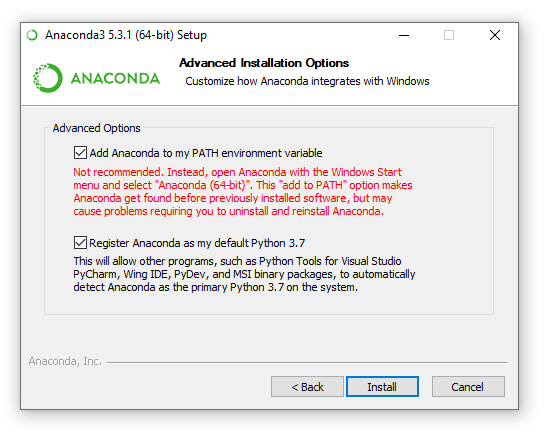

==================
Get Started
==================

Install Python
==============

In order to make use of the PyMedPhys library, you'll need Python installed on
your workstation. On Windows we recommend that you install the
Anaconda Python distribution. Download the latest Anaconda
version from `here <https://www.anaconda.com/products/individual#Downloads>`__.

.. note::

    When installing Anaconda make sure to install it for your user only, and
    tick the option "add to path".

On Linux or MacOS we recommend not using your system Python and instead
managing your Python installation using something like `pyenv`_.

.. _`pyenv`: https://github.com/pyenv/pyenv-installer#install

Installing PyMedPhys
====================

Once you have Python you can now install PyMedPhys via pip by typing the
following in a terminal or command prompt:

.. code:: bash

    pip install pymedphys[user]

You may need to open and close your terminal if you have only just installed
Python. The ``[user]`` option is needed to install pymedphys with its
"batteries included" so-to-speak. It will go and install a range of
dependencies which you may need during your use of pymedphys.

A minimal installation (Advanced users only)
--------------------------------------------

If you're not interested in installing PyMedPhys' dependencies you can choose
to skip the ``[user]`` option as so:

.. code:: bash

    pip install pymedphys

Installing the Bleeding Edge version of PyMedPhys (Advanced users only)
=======================================================================

If you wish to be able to contribute to PyMedPhys itself you are going to want
to instead install PyMedPhys from the main branch on GitHub
<https://github.com/pymedphys/pymedphys>. To achieve this follow the OS
specific instructions within the contributor tutorials:

* :doc:`../../contrib/setups/setup-win`
* :doc:`../../contrib/setups/setup-linux`
* :doc:`../../contrib/setups/setup-mac`
