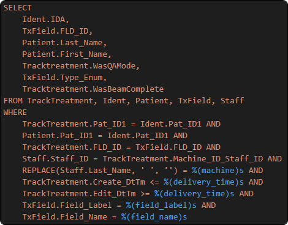

====================================
Elekta Logfile Decoding and Indexing
====================================

Project aim
-----------
The aim of this project is to have an automated machine record based delivery
check between the treatment planning system, the information system, and the
Linac for every patient and fraction.

.. WARNING::

   **It is not the intent of this project to replace patient specific QA
   measurements**. Some reasons this is likely not a sufficient replacement:

   * Linac reported MLC and Jaw positions are not independent from the machine and
     a fault resulting in mispositioning of the collimation may not be reported
     within the log files.
   * The treatment planning system beam models (as well as potentially any
     independent calculation software) may not accurately model the MLCs [1]_, and
     therefore, checking leaf position, without a dose measurement, may not be
     sufficient verification.

Presentations Related to this Project
-------------------------------------

Portions of this project have been presented and are scheduled to be presented
in the future. The links below provide downloads of the respective slides.

* `Comparing the Reported MLC and Jaw Positions Between Mosaiq and Elekta Linac Delivery at EPSM 2018`_.
* Open source tools for converting 40 ms resolution trf Elekta log files into
  DICOM RT Plan format for log file-derived dose reconstruction at ICCR 2019.

.. _`Comparing the Reported MLC and Jaw Positions Between Mosaiq and Elekta Linac Delivery at EPSM 2018`: http://simonbiggs.net/epsm2018

Details
-------
The diagnostic backups of an Elekta Linac contain the trf log files which detail
every Linac delivery for the previous 8 days to a time resolution of 25 Hz.

A portion of an example decoded logfile looks like the following:

.. image:: ../../img/logfile_example.png

The log files contain information such as MLC and Jaw positions, MU delivered,
gantry
couch and collimator angles, and more. For a full list of the column names in
the log files
see the `logfile config code`_.

.. _`logfile config code`: https://github.com/pymedphys/pymedphys/blob/b6d2c0500ee90af1eb189ba44d96e0c5cf242e80/src/pymedphys/trf/_data/config.json#L25-L376

These log files can be extracted and then associated to a patient's record
using Mosaiq SQL. This is achieved by aligning the logfile to the recorded
delivery time as well
as other parameters such as field ID and description the logfile is aligned to
Patient Name and ID. Example SQL to achieve this looks like the following:

An index is then created, at this current time the index is json file, but this
has issues when the index becomes large. It is expected that a backwards
incompatible change will occur in the near future converting the index json
format into SQLite. An example entry within this index looks like the
following:

.. image:: ../../img/index_example.png

This process of extracting and indexing can be set to run at a regular interval
so that an up to date logfile index is available.

Post indexing these log files can be decoded into csv format for human
reading, a MetersetMap can be calculated, or they can be mapped to a DICOM
file for the recalculation of dose.

References
----------

.. [1] Gholampourkashi, Sara, et al. "Monte Carlo and analytic modeling of an Elekta
   Infinity linac with Agility MLC: Investigating the significance of accurate
   model parameters for small radiation fields."
   *Journal of Applied Clinical Medical Physics* 20.1 (2019): 55-67. https://doi.org/10.1002/acm2.12485.
