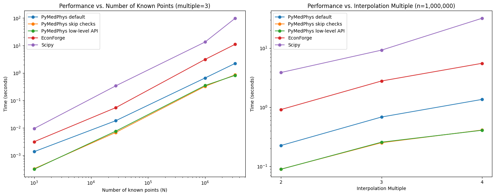

#############
Interpolation
#############

*******
Summary
*******

.. automodule:: pymedphys.interpolate
    :no-members:

.. _Performance Comparison Between Implementations:
Performance Comparison Between Implementations
----------------------------------------------

(Right-click and open in a new tab for better viewing)

***
API
***

Interpolation - High Level Interface (Recommended)
--------------------------------------------------

.. autofunction:: pymedphys.interpolate.interp

Interpolation - Low Level Interfaces
------------------------------------
It generally shouldn't be necessary to use these in lieu of
`pymedphys.interpolate.interp()`, since running `interp()` with
`skip_checks=True` will produce similar speed performance. See
`Performance Comparison Between Implementations`_

.. autofunction:: pymedphys.interpolate.interp_linear_1d

.. autofunction:: pymedphys.interpolate.interp_linear_2d

.. autofunction:: pymedphys.interpolate.interp_linear_3d

Interpolation - Visualisation
-----------------------------

.. autofunction:: pymedphys.interpolate.plot_interp_comparison_heatmap
