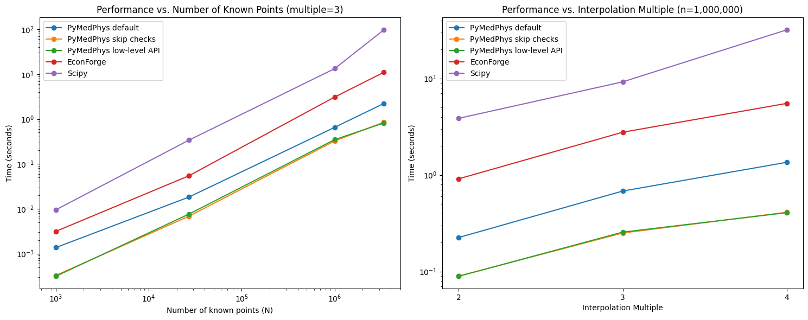

#############
Interpolation
#############

*******
Summary
*******

.. automodule:: pymedphys.interpolate
    :no-members:

.. _Performance Comparison Between Implementations:

Performance Comparison Between Implementations
----------------------------------------------
The :doc:`interpolation notebook <../../howto/interp/implementation_comparison>`
times each PyMedPhys interface against SciPy's ``RegularGridInterpolator`` and
checks that their outputs agree. The documentation build runs it, so its plot
reflects the current code. Hardware, package versions, input size, and thread
count affect timings.

    Historical benchmark, including EconForge's ``interpolation``. This saved
    image is not regenerated by documentation builds; its timings reflect the
    code, dependencies and hardware used for the original comparison.

***
API
***

Interpolation - High Level Interface (Recommended)
--------------------------------------------------

.. autofunction:: pymedphys.interpolate.interp

Interpolation - Low Level Interfaces
------------------------------------
It generally shouldn't be necessary to use these in lieu of
`pymedphys.interpolate.interp()`, since running `interp()` with
`skip_checks=True` will produce similar speed performance. See
`Performance Comparison Between Implementations`_

.. autofunction:: pymedphys.interpolate.interp_linear_1d

.. autofunction:: pymedphys.interpolate.interp_linear_2d

.. autofunction:: pymedphys.interpolate.interp_linear_3d

Interpolation - Visualisation
-----------------------------

.. autofunction:: pymedphys.interpolate.plot_interp_comparison_heatmap
